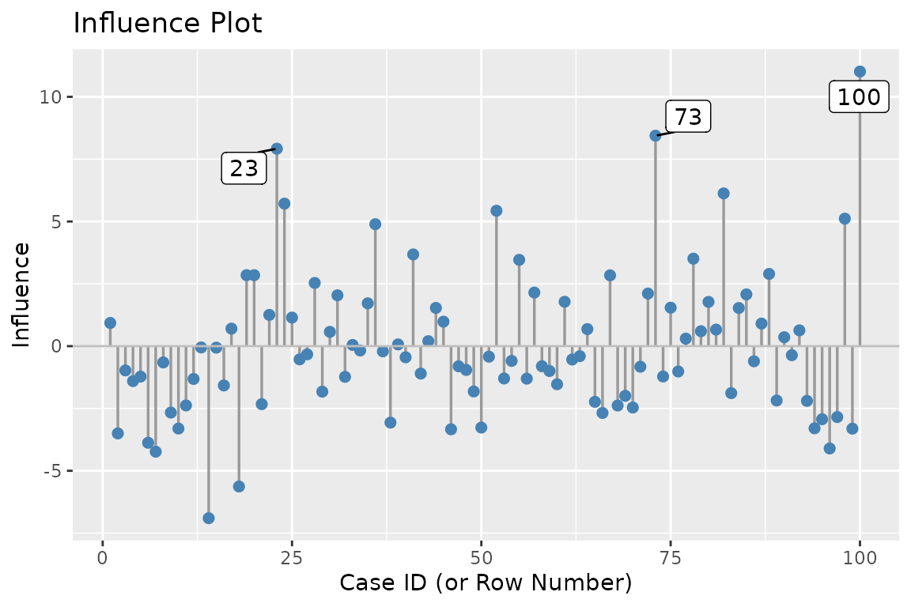
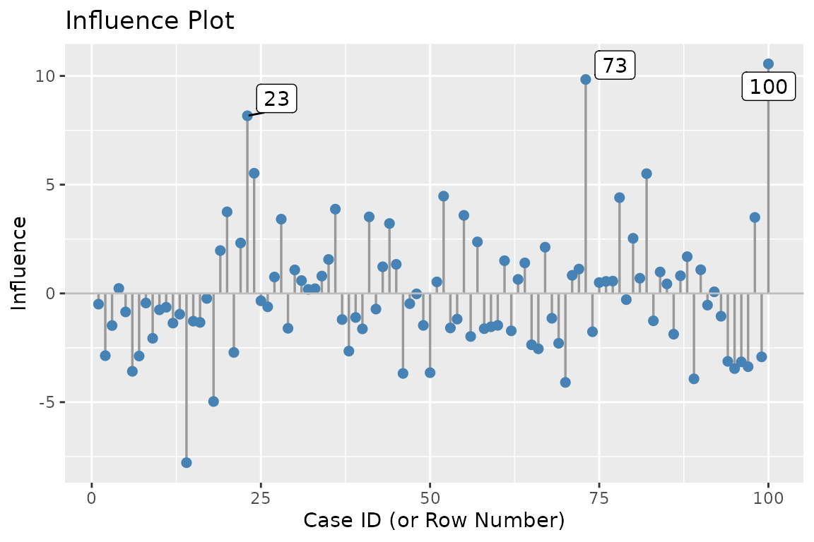
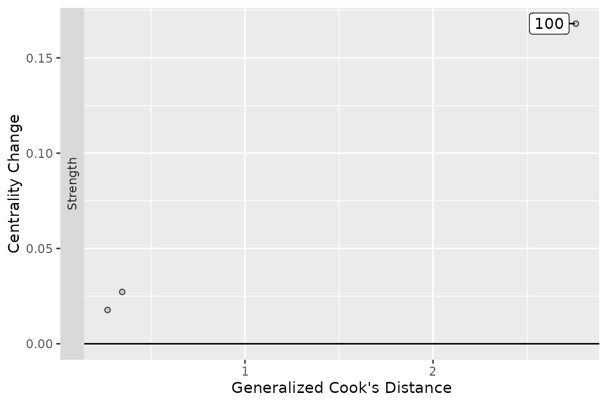
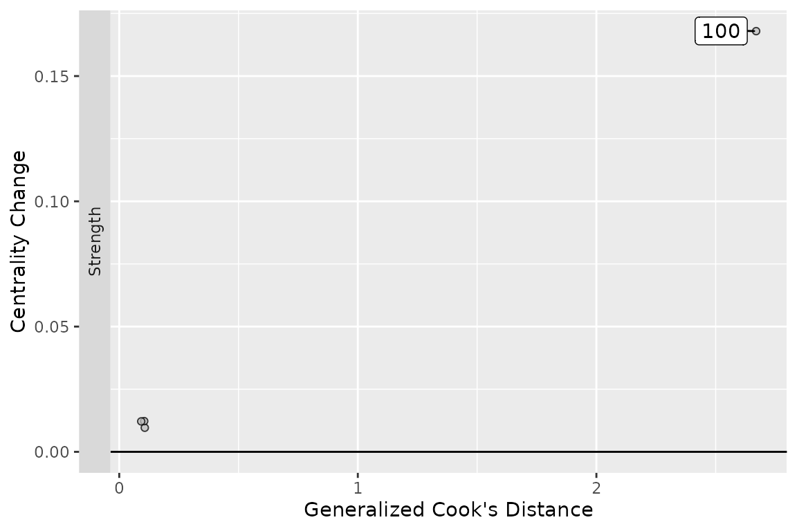
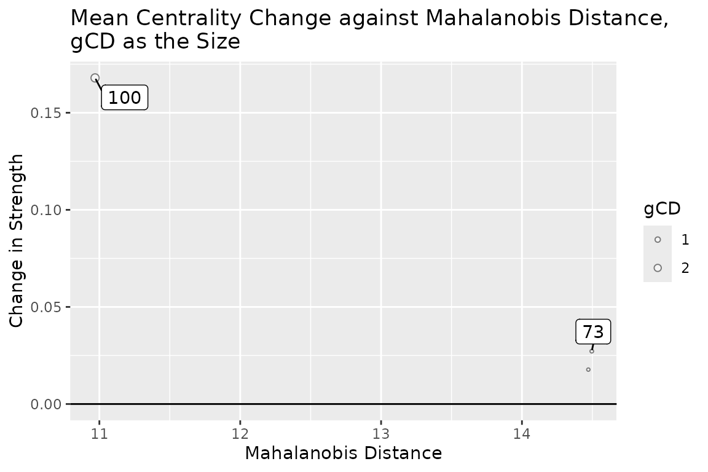
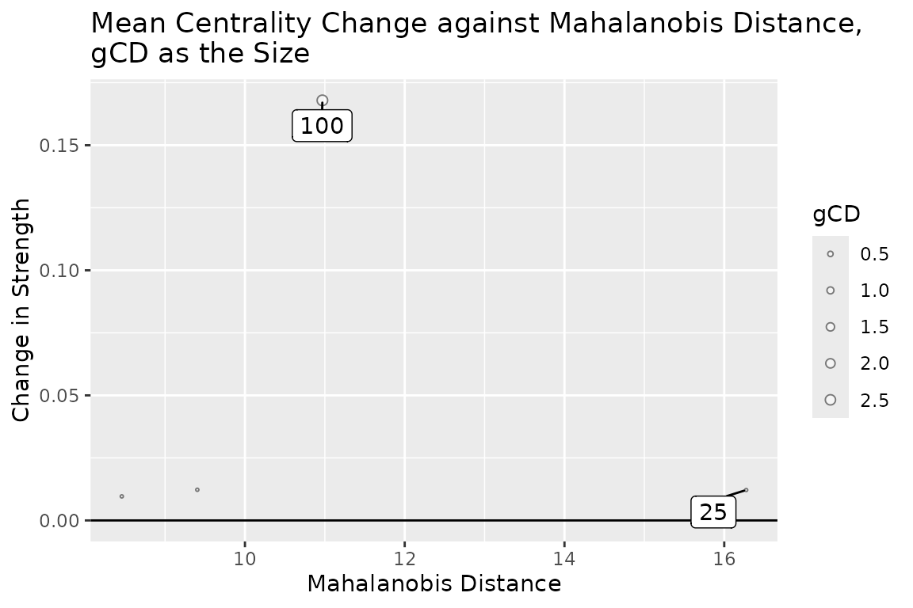

# netinf-guide

## Getting started with netinf

`netinf` identifies **influential cases** in psychological network
analysis.

In network analysis, we often care about “which cases have the largest
impact on the results?” For example, after removing a case, does the
global strength, the centrality ranking, or even the sign of an edge
change? `netinf` strings these diagnostic steps together into a coherent
workflow.

This package contains the following three main parts:

1.  **Core components**: extracting case indices from bootstrap samples
    → computing empirical influence values → leave-one-out validation →
    computing centrality gCD
2.  **All-in-one function**:
    [`influence_diagnostic()`](https://yangborui859-maker.github.io/netinf/reference/influence_diagnostic.md)
    performs all of the above in one call
3.  **Visualization**: three `plot` functions

### Table of contents

- [Overview](#overview)
- [Step 1: bootnet_with_indices](#step-1)
- [Step 2: calculate_empirical_influence](#step-2)
- [Step 3: leave_one_out_analysis](#step-3)
- [Step 4: calculate_centrality_gCD](#step-4)
- [All-in-one: influence_diagnostic](#all-in-one)
- [Visualization](#visualization)
  - [influence_plot](#plot-influence)
  - [gcds_plot](#plot-gcds)
  - [gcds_md_plot](#plot-gcds-md)

------------------------------------------------------------------------

## Overview

`netinf` is designed as a **bottom-up pipeline**:

| Step | Function | Purpose |
|----|----|----|
| 1 | [`bootnet_with_indices()`](https://yangborui859-maker.github.io/netinf/reference/bootnet_with_indices.md) | Extract case indices from bootstrap samples |
| 2 | [`calculate_empirical_influence()`](https://yangborui859-maker.github.io/netinf/reference/calculate_empirical_influence.md) | Compute empirical influence value per case |
| 3 | [`leave_one_out_analysis()`](https://yangborui859-maker.github.io/netinf/reference/leave_one_out_analysis.md) | Validate candidates via leave-one-out |
| 4 | [`calculate_centrality_gCD()`](https://yangborui859-maker.github.io/netinf/reference/calculate_centrality_gCD.md) | Diagnose centrality changes via generalized Cook’s distance |

We can run each step manually, or use
[`influence_diagnostic()`](https://yangborui859-maker.github.io/netinf/reference/influence_diagnostic.md)
to run all four steps in one call.

## Step 1: bootnet_with_indices

## The core idea: why we need case indices

### What bootstrap does in network analysis

The core of network analysis is estimating a network structure (e.g., a
partial correlation network, a GLASSO network). But **how stable is the
estimated network?**

The standard approach is **bootstrap**: draw $`n`$ cases with
replacement from the original data and re-estimate the network.
Repeating this $`B`$ times gives us $`B`$ “resampled networks”, which we
can use to assess the confidence intervals of edge weights, the
stability of centrality, and so on.

Mathematically, the $`b`$-th bootstrap sample is:

``` math
X^{(b)} = \{x_{i_1^{(b)}}, x_{i_2^{(b)}}, \dots, x_{i_n^{(b)}}\}
```

where each $`i_k^{(b)} \in \{1, 2, \dots, n\}`$ is a **case index drawn
with replacement** from the original data.

### The problem: `bootnet` does not store these indices by default

By default,
[`bootnet::bootnet()`](https://rdrr.io/pkg/bootnet/man/bootnet.html)
uses `memorysaver = TRUE`. To save memory, it does **not** store the
bootstrap data, nor the sampling indices $`i_k^{(b)}`$.

But to compute the “empirical influence” of each case—which measures how
much a case influences the results via its inclusion frequency—we **must
know which cases were drawn in each bootstrap sample**.

### The solution: `bootnet_with_indices()`

[`bootnet_with_indices()`](https://yangborui859-maker.github.io/netinf/reference/bootnet_with_indices.md)
does three things:

1.  Calls
    [`bootnet::bootnet()`](https://rdrr.io/pkg/bootnet/man/bootnet.html)
    with `memorysaver = FALSE`, so that the data from each bootstrap
    sample is retained
2.  Recovers the original case indices from the **row names** of each
    bootstrap dataset
3.  By default, uses `keep_data = FALSE` to discard the data immediately
    after the indices are extracted, saving memory

The returned object is a `bootnetWithIndices` object: a `bootnet` result
with an additional object `bootIndices`.

## Basic usage

### Setup

``` r

library(netinf)
```

We use a simulated dataset based on the 9 variables from the
HolzingerSwineford1939 dataset in lavaan.

``` r

set.seed(123)
dat <- lavaan::HolzingerSwineford1939
datused <- dat[, paste0("x", 1:9)]

#Following Fried's suggestion(2017),N/P > 10
sample_idx <- sample(1:nrow(datused), 99)
data_99 <- datused[sample_idx, ]
means_99 <- colMeans(data_99)
sds_99 <- sapply(data_99, sd)
case_100 <- numeric(9)

#One influential case
names(case_100) <- paste0("x", 1:9)
case_100 <- means_99 + 2 * sds_99
data <- rbind(data_99, case_100)
rownames(data) <- seq_len(nrow(data))
```

### Calling `bootnet_with_indices()`

``` r

set.seed(1)
boot_res <- bootnet_with_indices(
  data,
  nBoots = 5000,
  default = "EBICglasso"
)
#>   |                                                                              |                                                                      |   0%  |                                                                              |                                                                      |   1%  |                                                                              |=                                                                     |   1%  |                                                                              |=                                                                     |   2%  |                                                                              |==                                                                    |   2%  |                                                                              |==                                                                    |   3%  |                                                                              |==                                                                    |   4%  |                                                                              |===                                                                   |   4%  |                                                                              |===                                                                   |   5%  |                                                                              |====                                                                  |   5%  |                                                                              |====                                                                  |   6%  |                                                                              |=====                                                                 |   6%  |                                                                              |=====                                                                 |   7%  |                                                                              |=====                                                                 |   8%  |                                                                              |======                                                                |   8%  |                                                                              |======                                                                |   9%  |                                                                              |=======                                                               |   9%  |                                                                              |=======                                                               |  10%  |                                                                              |=======                                                               |  11%  |                                                                              |========                                                              |  11%  |                                                                              |========                                                              |  12%  |                                                                              |=========                                                             |  12%  |                                                                              |=========                                                             |  13%  |                                                                              |=========                                                             |  14%  |                                                                              |==========                                                            |  14%  |                                                                              |==========                                                            |  15%  |                                                                              |===========                                                           |  15%  |                                                                              |===========                                                           |  16%  |                                                                              |============                                                          |  16%  |                                                                              |============                                                          |  17%  |                                                                              |============                                                          |  18%  |                                                                              |=============                                                         |  18%  |                                                                              |=============                                                         |  19%  |                                                                              |==============                                                        |  19%  |                                                                              |==============                                                        |  20%  |                                                                              |==============                                                        |  21%  |                                                                              |===============                                                       |  21%  |                                                                              |===============                                                       |  22%  |                                                                              |================                                                      |  22%  |                                                                              |================                                                      |  23%  |                                                                              |================                                                      |  24%  |                                                                              |=================                                                     |  24%  |                                                                              |=================                                                     |  25%  |                                                                              |==================                                                    |  25%  |                                                                              |==================                                                    |  26%  |                                                                              |===================                                                   |  26%  |                                                                              |===================                                                   |  27%  |                                                                              |===================                                                   |  28%  |                                                                              |====================                                                  |  28%  |                                                                              |====================                                                  |  29%  |                                                                              |=====================                                                 |  29%  |                                                                              |=====================                                                 |  30%  |                                                                              |=====================                                                 |  31%  |                                                                              |======================                                                |  31%  |                                                                              |======================                                                |  32%  |                                                                              |=======================                                               |  32%  |                                                                              |=======================                                               |  33%  |                                                                              |=======================                                               |  34%  |                                                                              |========================                                              |  34%  |                                                                              |========================                                              |  35%  |                                                                              |=========================                                             |  35%  |                                                                              |=========================                                             |  36%  |                                                                              |==========================                                            |  36%  |                                                                              |==========================                                            |  37%  |                                                                              |==========================                                            |  38%  |                                                                              |===========================                                           |  38%  |                                                                              |===========================                                           |  39%  |                                                                              |============================                                          |  39%  |                                                                              |============================                                          |  40%  |                                                                              |============================                                          |  41%  |                                                                              |=============================                                         |  41%  |                                                                              |=============================                                         |  42%  |                                                                              |==============================                                        |  42%  |                                                                              |==============================                                        |  43%  |                                                                              |==============================                                        |  44%  |                                                                              |===============================                                       |  44%  |                                                                              |===============================                                       |  45%  |                                                                              |================================                                      |  45%  |                                                                              |================================                                      |  46%  |                                                                              |=================================                                     |  46%  |                                                                              |=================================                                     |  47%  |                                                                              |=================================                                     |  48%  |                                                                              |==================================                                    |  48%  |                                                                              |==================================                                    |  49%  |                                                                              |===================================                                   |  49%  |                                                                              |===================================                                   |  50%  |                                                                              |===================================                                   |  51%  |                                                                              |====================================                                  |  51%  |                                                                              |====================================                                  |  52%  |                                                                              |=====================================                                 |  52%  |                                                                              |=====================================                                 |  53%  |                                                                              |=====================================                                 |  54%  |                                                                              |======================================                                |  54%  |                                                                              |======================================                                |  55%  |                                                                              |=======================================                               |  55%  |                                                                              |=======================================                               |  56%  |                                                                              |========================================                              |  56%  |                                                                              |========================================                              |  57%  |                                                                              |========================================                              |  58%  |                                                                              |=========================================                             |  58%  |                                                                              |=========================================                             |  59%  |                                                                              |==========================================                            |  59%  |                                                                              |==========================================                            |  60%  |                                                                              |==========================================                            |  61%  |                                                                              |===========================================                           |  61%  |                                                                              |===========================================                           |  62%  |                                                                              |============================================                          |  62%  |                                                                              |============================================                          |  63%  |                                                                              |============================================                          |  64%  |                                                                              |=============================================                         |  64%  |                                                                              |=============================================                         |  65%  |                                                                              |==============================================                        |  65%  |                                                                              |==============================================                        |  66%  |                                                                              |===============================================                       |  66%  |                                                                              |===============================================                       |  67%  |                                                                              |===============================================                       |  68%  |                                                                              |================================================                      |  68%  |                                                                              |================================================                      |  69%  |                                                                              |=================================================                     |  69%  |                                                                              |=================================================                     |  70%  |                                                                              |=================================================                     |  71%  |                                                                              |==================================================                    |  71%  |                                                                              |==================================================                    |  72%  |                                                                              |===================================================                   |  72%  |                                                                              |===================================================                   |  73%
#>   |                                                                              |===================================================                   |  74%  |                                                                              |====================================================                  |  74%  |                                                                              |====================================================                  |  75%  |                                                                              |=====================================================                 |  75%  |                                                                              |=====================================================                 |  76%  |                                                                              |======================================================                |  76%  |                                                                              |======================================================                |  77%  |                                                                              |======================================================                |  78%  |                                                                              |=======================================================               |  78%  |                                                                              |=======================================================               |  79%  |                                                                              |========================================================              |  79%  |                                                                              |========================================================              |  80%  |                                                                              |========================================================              |  81%  |                                                                              |=========================================================             |  81%  |                                                                              |=========================================================             |  82%  |                                                                              |==========================================================            |  82%  |                                                                              |==========================================================            |  83%  |                                                                              |==========================================================            |  84%  |                                                                              |===========================================================           |  84%  |                                                                              |===========================================================           |  85%  |                                                                              |============================================================          |  85%  |                                                                              |============================================================          |  86%  |                                                                              |=============================================================         |  86%  |                                                                              |=============================================================         |  87%  |                                                                              |=============================================================         |  88%  |                                                                              |==============================================================        |  88%  |                                                                              |==============================================================        |  89%  |                                                                              |===============================================================       |  89%  |                                                                              |===============================================================       |  90%  |                                                                              |===============================================================       |  91%  |                                                                              |================================================================      |  91%  |                                                                              |================================================================      |  92%  |                                                                              |=================================================================     |  92%  |                                                                              |=================================================================     |  93%  |                                                                              |=================================================================     |  94%  |                                                                              |==================================================================    |  94%  |                                                                              |==================================================================    |  95%  |                                                                              |===================================================================   |  95%  |                                                                              |===================================================================   |  96%  |                                                                              |====================================================================  |  96%  |                                                                              |====================================================================  |  97%  |                                                                              |====================================================================  |  98%  |                                                                              |===================================================================== |  98%  |                                                                              |===================================================================== |  99%  |                                                                              |======================================================================|  99%  |                                                                              |======================================================================| 100%
#>   |                                                                              |                                                                      |   0%  |                                                                              |                                                                      |   1%  |                                                                              |=                                                                     |   1%  |                                                                              |=                                                                     |   2%  |                                                                              |==                                                                    |   2%  |                                                                              |==                                                                    |   3%  |                                                                              |==                                                                    |   4%  |                                                                              |===                                                                   |   4%  |                                                                              |===                                                                   |   5%  |                                                                              |====                                                                  |   5%  |                                                                              |====                                                                  |   6%  |                                                                              |=====                                                                 |   6%  |                                                                              |=====                                                                 |   7%  |                                                                              |=====                                                                 |   8%  |                                                                              |======                                                                |   8%  |                                                                              |======                                                                |   9%  |                                                                              |=======                                                               |   9%  |                                                                              |=======                                                               |  10%  |                                                                              |=======                                                               |  11%  |                                                                              |========                                                              |  11%  |                                                                              |========                                                              |  12%  |                                                                              |=========                                                             |  12%  |                                                                              |=========                                                             |  13%  |                                                                              |=========                                                             |  14%  |                                                                              |==========                                                            |  14%  |                                                                              |==========                                                            |  15%  |                                                                              |===========                                                           |  15%  |                                                                              |===========                                                           |  16%  |                                                                              |============                                                          |  16%  |                                                                              |============                                                          |  17%  |                                                                              |============                                                          |  18%  |                                                                              |=============                                                         |  18%  |                                                                              |=============                                                         |  19%  |                                                                              |==============                                                        |  19%  |                                                                              |==============                                                        |  20%  |                                                                              |==============                                                        |  21%  |                                                                              |===============                                                       |  21%  |                                                                              |===============                                                       |  22%  |                                                                              |================                                                      |  22%  |                                                                              |================                                                      |  23%  |                                                                              |================                                                      |  24%  |                                                                              |=================                                                     |  24%  |                                                                              |=================                                                     |  25%  |                                                                              |==================                                                    |  25%  |                                                                              |==================                                                    |  26%  |                                                                              |===================                                                   |  26%  |                                                                              |===================                                                   |  27%  |                                                                              |===================                                                   |  28%  |                                                                              |====================                                                  |  28%  |                                                                              |====================                                                  |  29%  |                                                                              |=====================                                                 |  29%  |                                                                              |=====================                                                 |  30%  |                                                                              |=====================                                                 |  31%  |                                                                              |======================                                                |  31%  |                                                                              |======================                                                |  32%  |                                                                              |=======================                                               |  32%  |                                                                              |=======================                                               |  33%  |                                                                              |=======================                                               |  34%  |                                                                              |========================                                              |  34%  |                                                                              |========================                                              |  35%  |                                                                              |=========================                                             |  35%  |                                                                              |=========================                                             |  36%  |                                                                              |==========================                                            |  36%  |                                                                              |==========================                                            |  37%  |                                                                              |==========================                                            |  38%  |                                                                              |===========================                                           |  38%  |                                                                              |===========================                                           |  39%  |                                                                              |============================                                          |  39%  |                                                                              |============================                                          |  40%  |                                                                              |============================                                          |  41%  |                                                                              |=============================                                         |  41%  |                                                                              |=============================                                         |  42%  |                                                                              |==============================                                        |  42%  |                                                                              |==============================                                        |  43%  |                                                                              |==============================                                        |  44%  |                                                                              |===============================                                       |  44%  |                                                                              |===============================                                       |  45%  |                                                                              |================================                                      |  45%  |                                                                              |================================                                      |  46%  |                                                                              |=================================                                     |  46%  |                                                                              |=================================                                     |  47%  |                                                                              |=================================                                     |  48%  |                                                                              |==================================                                    |  48%  |                                                                              |==================================                                    |  49%  |                                                                              |===================================                                   |  49%  |                                                                              |===================================                                   |  50%  |                                                                              |===================================                                   |  51%  |                                                                              |====================================                                  |  51%  |                                                                              |====================================                                  |  52%  |                                                                              |=====================================                                 |  52%  |                                                                              |=====================================                                 |  53%  |                                                                              |=====================================                                 |  54%  |                                                                              |======================================                                |  54%  |                                                                              |======================================                                |  55%  |                                                                              |=======================================                               |  55%  |                                                                              |=======================================                               |  56%  |                                                                              |========================================                              |  56%  |                                                                              |========================================                              |  57%  |                                                                              |========================================                              |  58%  |                                                                              |=========================================                             |  58%  |                                                                              |=========================================                             |  59%  |                                                                              |==========================================                            |  59%  |                                                                              |==========================================                            |  60%  |                                                                              |==========================================                            |  61%  |                                                                              |===========================================                           |  61%  |                                                                              |===========================================                           |  62%  |                                                                              |============================================                          |  62%  |                                                                              |============================================                          |  63%  |                                                                              |============================================                          |  64%  |                                                                              |=============================================                         |  64%  |                                                                              |=============================================                         |  65%  |                                                                              |==============================================                        |  65%  |                                                                              |==============================================                        |  66%  |                                                                              |===============================================                       |  66%  |                                                                              |===============================================                       |  67%  |                                                                              |===============================================                       |  68%  |                                                                              |================================================                      |  68%  |                                                                              |================================================                      |  69%  |                                                                              |=================================================                     |  69%  |                                                                              |=================================================                     |  70%  |                                                                              |=================================================                     |  71%  |                                                                              |==================================================                    |  71%  |                                                                              |==================================================                    |  72%  |                                                                              |===================================================                   |  72%  |                                                                              |===================================================                   |  73%  |                                                                              |===================================================                   |  74%  |                                                                              |====================================================                  |  74%  |                                                                              |====================================================                  |  75%  |                                                                              |=====================================================                 |  75%  |                                                                              |=====================================================                 |  76%  |                                                                              |======================================================                |  76%  |                                                                              |======================================================                |  77%  |                                                                              |======================================================                |  78%  |                                                                              |=======================================================               |  78%  |                                                                              |=======================================================               |  79%  |                                                                              |========================================================              |  79%  |                                                                              |========================================================              |  80%  |                                                                              |========================================================              |  81%  |                                                                              |=========================================================             |  81%  |                                                                              |=========================================================             |  82%  |                                                                              |==========================================================            |  82%  |                                                                              |==========================================================            |  83%  |                                                                              |==========================================================            |  84%  |                                                                              |===========================================================           |  84%  |                                                                              |===========================================================           |  85%  |                                                                              |============================================================          |  85%  |                                                                              |============================================================          |  86%  |                                                                              |=============================================================         |  86%  |                                                                              |=============================================================         |  87%  |                                                                              |=============================================================         |  88%  |                                                                              |==============================================================        |  88%  |                                                                              |==============================================================        |  89%  |                                                                              |===============================================================       |  89%  |                                                                              |===============================================================       |  90%  |                                                                              |===============================================================       |  91%  |                                                                              |================================================================      |  91%  |                                                                              |================================================================      |  92%  |                                                                              |=================================================================     |  92%  |                                                                              |=================================================================     |  93%  |                                                                              |=================================================================     |  94%  |                                                                              |==================================================================    |  94%  |                                                                              |==================================================================    |  95%  |                                                                              |===================================================================   |  95%  |                                                                              |===================================================================   |  96%  |                                                                              |====================================================================  |  96%  |                                                                              |====================================================================  |  97%  |                                                                              |====================================================================  |  98%  |                                                                              |===================================================================== |  98%  |                                                                              |===================================================================== |  99%  |                                                                              |======================================================================|  99%  |                                                                              |======================================================================| 100%
```

### Structure of the returned object

``` r

class(boot_res)
#> [1] "bootnetWithIndices" "bootnet"
names(boot_res)
#> [1] "sampleTable" "bootTable"   "sample"      "boots"       "type"       
#> [6] "sampleSize"  "bootIndices"
```

In addition to the `bootnet` objects (`sample`, `boots`, `sampleTable`,
`bootTable`, etc.), there is one extra object “bootIndices”:

``` r

# The case indices drawn in each bootstrap sample
length(boot_res$bootIndices)      # equals nBoots
#> [1] 5000
str(boot_res$bootIndices[[1]])    # indices from the first bootstrap
#>  num [1:100] 68 39 1 34 87 43 14 82 59 51 ...
```

`bootIndices[[b]]` is a vector of length $`n`$. Its $`k`$-th element
indicates which row of the original data was drawn at position $`k`$ in
the $`b`$-th bootstrap sample.

These indices are the input to
[`calculate_empirical_influence()`](https://yangborui859-maker.github.io/netinf/reference/calculate_empirical_influence.md),
which turns them into a numeric influence value per case.

## Step 2: calculate_empirical_influence

### Why this step exists

This step use very little computing power to output some valuable
information in addition to the work that researchers inevitably have to
do. And this is why we do not conduct leave-one-out analysis directly.

We need a **single number per case** that quantifies: *how much does
this case influence the network’s global structure?*

[`calculate_empirical_influence()`](https://yangborui859-maker.github.io/netinf/reference/calculate_empirical_influence.md)
answers this question by regressing a network-level summary (global
strength) on the inclusion counts of each case.

#### Global strength

For each bootstrap network, compute its **global strength(sum of
absolute edge weights)**:

``` math
\text{GS}^{(b)} = \sum_{j < k} |w_{jk}^{(b)}|
```

where $`w_{jk}^{(b)}`$ is the edge weight between nodes $`j`$ and $`k`$
in the $`b`$-th bootstrap network.

#### Inclusion counts

For each case $`i`$ and bootstrap sample $`b`$, let:

``` math
c_i^{(b)} = \text{number of times case } i \text{ appears in bootstrap sample } b
```

This is exactly the information stored in `bootIndices[[b]]` (as a
frequency table).

#### The regression

We fit a linear model:

``` math
\text{GS}^{(b)} = \beta_0 + \sum_{i=1}^{n} \beta_i \cdot c_i^{(b)} + \varepsilon^{(b)}
```

The coefficient of empirical influence $`\beta_i`$ measures **how much
case $`i`$ contributes to global strength**.

#### Two details

1.  **Drop one case to avoid collinearity.** Since
    $`\sum_i c_i^{(b)} = n`$ for every $`b`$, the inclusion counts are
    perfectly collinear with the intercept. The function drops case 1
    and sets its influence value via the sum-to-zero constraint.

2.  **Center to mean zero.** After estimating
    $`\beta_1, \dots, \beta_n`$, the values are centered:
    ``` math
    \tilde{\beta}_i = \beta_i - \frac{1}{n} \sum_{j=1}^{n} \beta_j
    ```
    so that the average influence is 0. Positive values mean “including
    this case increases global strength”; negative values mean the
    opposite.

### Basic usage

``` r

empic <- calculate_empirical_influence(boot_res)
```

The result is a numeric vector of length $`n`$, with a class
`"empiricalInfluence"`:

``` r

class(empic)
#> [1] "empiricalInfluence"
length(empic)
#> [1] 100
```

### Structure of the output

``` r

print(empic, n = 10)    #For demo, only 10 cases were printed(10 cases with largest abs value)
#> Empirical Influence Values
#> ==========================
#> 
#> Showing top 10 of 100 cases by absolute influence:
#> 
#>  case_id influence
#>      100 10.554229
#>       73  9.837622
#>       23  8.166919
#>       14 -7.783677
#>       24  5.524770
#>       82  5.505637
#>       18 -4.968687
#>       52  4.471433
#>       78  4.404015
#>       70 -4.092135
summary(as.numeric(empic))
#>    Min. 1st Qu.  Median    Mean 3rd Qu.    Max. 
#> -7.7837 -1.6230 -0.4559  0.0000  1.1463 10.5542
```

### Interpreting the output

A **large positive** value for case $`i`$ means:

> Including case $`i`$ in the sample tends to **increase** global
> strength.

A **large negative** value means:

> Including case $`i`$ tends to **decrease** global strength.

> **Note**: These values are **regression coefficients**. In this
> regression, each case’s **inclusion proportion** in a bootstrap sample
> ranges from 0 (never drawn) to 1 (always drawn). The coefficient for
> case $`i`$ therefore quantifies: *how much the predicted global
> strength changes when case $`i`$’s inclusion proportion moves from 0
> to 1, holding the other cases constant in the regression sense*.
>
> This is a **hypothetical 0-to-1 change**—in any single bootstrap
> sample the proportions sum to 1, so no case can independently reach 1.
> The values are meaningful only for **ranking cases within the same
> analysis**. To measure the actual change in global strength, use
> [`leave_one_out_analysis()`](https://yangborui859-maker.github.io/netinf/reference/leave_one_out_analysis.md)
> (see [Step 3](#step-3)), which physically removes the case and
> re-estimates the network. \## Possible pitfalls

#### 1. `nBoots` must be large enough

If `nBoots` is too small, the regression may not stable. Roughly
speaking, 5000+ is good.

#### 2. Sparse network need more boots

If all bootstrap networks have almost the same global strength (e.g.,
because the network is nearly empty), the response variable has almost
zero variance and the regression may fails when `nBoots` is small.

### Next step

The empirical influence values identify **candidate** influential
cases—those with large absolute coefficient. The next function,
[`leave_one_out_analysis()`](https://yangborui859-maker.github.io/netinf/reference/leave_one_out_analysis.md),
**validates** these candidates by actually removing them from the data
and re-estimating the network, one case at a time (or several at once if
specifying `remove_cases`).

## Step 3: leave_one_out_analysis

### Why this step exists

To confirm that a candidate truly matters, we need to **actually remove
it** from the data, **re-estimate the network**, and see what changes.
This is what
[`leave_one_out_analysis()`](https://yangborui859-maker.github.io/netinf/reference/leave_one_out_analysis.md)
does.

### The idea

#### Leave-one/multiple-out validation

The core operation is simple: take the data, **remove one or several
cases**, re-estimate the network, and compare it to the full-sample
network.

For a single case $`i`$:

``` math
\hat{G}^{(-i)} = \text{estimateNetwork}(X \setminus \{x_i\})
```

For a set of cases $`S`$:

``` math
\hat{G}^{(-S)} = \text{estimateNetwork}(X \setminus \{x_{i} : i \in S\})
```

The function supports both:

- **Single-case removal**: remove one case at a time and compare each
  result to the full network. This is the classic leave-one-out (LOO)
  design and returns an object of class `looAnalysis`.
- **Multi-case removal**: remove several cases **simultaneously** and
  compare the resulting network to the full network. This is a
  leave-multiple-out (LMO) design and returns an object of class
  `looMultiAnalysis`.

The multi-case design is also useful when you suspect that several cases
act **jointly**—their combined effect may differ from the sum of
individual effects, especially if they are correlated or share a common
pattern.

For each removed case or set, the re-estimated network
$`\hat{G}^{(-i)}`$ (or $`\hat{G}^{(-S)}`$) is compared to the
full-sample network $`\hat{G}`$ on several dimensions:

- **Global strength**: how much does the sum of absolute edge weights
  change?
- **Edges disappeared**: present in $`\hat{G}`$, zero in
  $`\hat{G}^{(-i)}`$?
- **Edges appeared**: zero in $`\hat{G}`$, present in
  $`\hat{G}^{(-i)}`$?
- **Edges reversed sign**: which edge would be opposite direction?

#### Three selection methods

The function needs to know **which cases to remove**. Supply one of
three options: `remove_cases` (manual IDs), `threshold` (select by
magnitude), or `top_n` (select the top N by magnitude). If **none** is
supplied, the function defaults to **all cases**

| Method | Argument | Behavior |
|----|----|----|
| Manual | `remove_cases` | vector of case IDs |
| Threshold | `threshold` | Select cases with $`|\text{empirical influence}| > \theta`$ |
| Top-N | `top_n` | Select the $`N`$ cases with largest $`|\text{empirical influence}|`$ |

If more than one is supplied, the priority is **`remove_cases` \>
`threshold` \> `top_n`**, and a warning tells you which arguments are
ignored.

#### Direction

For `threshold` and `top_n`, the `direction` argument controls which
tail of the influence distribution to select:

- `"both"`: use $`|\text{influence}|`$ (default)
- `"positive"`: only cases that increase global strength
- `"negative"`: only cases that decrease global strength

#### Two output classes

- **One case removed at a time** (`remove_cases` has length 1, or
  `threshold` / `top_n` produce one candidate): returns `looAnalysis`
- **Multiple cases removed simultaneously** (`remove_cases` has length
  \> 1): returns `looMultiAnalysis`

### Basic usage

#### Option 1: select the top 3 most influential cases

``` r

loo_res <- leave_one_out_analysis(
  influence_result = empic,
  data             = data,
  top_n            = 3,
  default          = "EBICglasso"
)
#>   |                                                                              |                                                                      |   0%  |                                                                              |=======================                                               |  33%  |                                                                              |===============================================                       |  67%
#>   |                                                                              |======================================================================| 100%
```

#### Option 2: select by threshold

``` r

loo_thr <- leave_one_out_analysis(
  influence_result = empic,
  data             = data,
  threshold        = 0.02,
  direction        = "both",
  default          = "EBICglasso"
)
#>   |                                                                              |                                                                      |   0%  |                                                                              |=                                                                     |   1%  |                                                                              |=                                                                     |   2%  |                                                                              |==                                                                    |   3%  |                                                                              |===                                                                   |   4%
#>   |                                                                              |====                                                                  |   5%  |                                                                              |====                                                                  |   6%
#>   |                                                                              |=====                                                                 |   7%  |                                                                              |======                                                                |   8%  |                                                                              |======                                                                |   9%
#>   |                                                                              |=======                                                               |  10%
#>   |                                                                              |========                                                              |  11%
#>   |                                                                              |========                                                              |  12%
#>   |                                                                              |=========                                                             |  13%  |                                                                              |==========                                                            |  14%  |                                                                              |===========                                                           |  15%
#>   |                                                                              |===========                                                           |  16%  |                                                                              |============                                                          |  17%
#>   |                                                                              |=============                                                         |  18%  |                                                                              |=============                                                         |  19%  |                                                                              |==============                                                        |  20%  |                                                                              |===============                                                       |  21%
#>   |                                                                              |================                                                      |  22%
#>   |                                                                              |================                                                      |  23%  |                                                                              |=================                                                     |  24%
#>   |                                                                              |==================                                                    |  25%  |                                                                              |==================                                                    |  26%  |                                                                              |===================                                                   |  27%
#>   |                                                                              |====================                                                  |  28%  |                                                                              |=====================                                                 |  29%  |                                                                              |=====================                                                 |  30%
#>   |                                                                              |======================                                                |  31%
#>   |                                                                              |=======================                                               |  32%
#>   |                                                                              |=======================                                               |  33%  |                                                                              |========================                                              |  34%  |                                                                              |=========================                                             |  35%  |                                                                              |=========================                                             |  36%  |                                                                              |==========================                                            |  37%
#>   |                                                                              |===========================                                           |  38%  |                                                                              |============================                                          |  39%  |                                                                              |============================                                          |  40%  |                                                                              |=============================                                         |  41%
#>   |                                                                              |==============================                                        |  42%
#>   |                                                                              |==============================                                        |  43%  |                                                                              |===============================                                       |  44%  |                                                                              |================================                                      |  45%  |                                                                              |=================================                                     |  46%  |                                                                              |=================================                                     |  47%  |                                                                              |==================================                                    |  48%
#>   |                                                                              |===================================                                   |  49%
#>   |                                                                              |===================================                                   |  51%  |                                                                              |====================================                                  |  52%
#>   |                                                                              |=====================================                                 |  53%  |                                                                              |=====================================                                 |  54%
#>   |                                                                              |======================================                                |  55%  |                                                                              |=======================================                               |  56%
#>   |                                                                              |========================================                              |  57%  |                                                                              |========================================                              |  58%
#>   |                                                                              |=========================================                             |  59%  |                                                                              |==========================================                            |  60%  |                                                                              |==========================================                            |  61%
#>   |                                                                              |===========================================                           |  62%  |                                                                              |============================================                          |  63%  |                                                                              |=============================================                         |  64%  |                                                                              |=============================================                         |  65%  |                                                                              |==============================================                        |  66%
#>   |                                                                              |===============================================                       |  67%  |                                                                              |===============================================                       |  68%  |                                                                              |================================================                      |  69%  |                                                                              |=================================================                     |  70%  |                                                                              |=================================================                     |  71%
#>   |                                                                              |==================================================                    |  72%  |                                                                              |===================================================                   |  73%
#>   |                                                                              |====================================================                  |  74%
#>   |                                                                              |====================================================                  |  75%  |                                                                              |=====================================================                 |  76%
#>   |                                                                              |======================================================                |  77%
#>   |                                                                              |======================================================                |  78%  |                                                                              |=======================================================               |  79%  |                                                                              |========================================================              |  80%  |                                                                              |=========================================================             |  81%
#>   |                                                                              |=========================================================             |  82%
#>   |                                                                              |==========================================================            |  83%  |                                                                              |===========================================================           |  84%  |                                                                              |===========================================================           |  85%
#>   |                                                                              |============================================================          |  86%  |                                                                              |=============================================================         |  87%  |                                                                              |==============================================================        |  88%  |                                                                              |==============================================================        |  89%  |                                                                              |===============================================================       |  90%  |                                                                              |================================================================      |  91%  |                                                                              |================================================================      |  92%
#>   |                                                                              |=================================================================     |  93%  |                                                                              |==================================================================    |  94%  |                                                                              |==================================================================    |  95%  |                                                                              |===================================================================   |  96%  |                                                                              |====================================================================  |  97%  |                                                                              |===================================================================== |  98%  |                                                                              |===================================================================== |  99%  |                                                                              |======================================================================| 100%
```

#### Option 3: manually remove specific cases(if multiple cases are specified, only leave-multiple-out now)

``` r

lmo_res <- leave_one_out_analysis(
  influence_result = empic,
  data             = data,
  remove_cases     = c(3, 7, 12),
  default          = "EBICglasso"
)
```

### Structure of the output

#### For `looAnalysis` (one case at a time)

``` r

loo_res
#> Leave-One-Out Analysis Results
#> ==============================
#> 
#> Selection method: top_3
#> Direction: both
#> Number of cases analyzed: 3
#> 
#> Summary:
#>   case_id empirical_influence global_weight-strength_change
#> 1     100           10.554229                  0.7557114974
#> 2      73            9.837622                  0.0973086900
#> 3      23            8.166919                  0.0009796011
#>   global_weight-strength_change(%) n_edges_disappeared n_edges_appeared
#> 1                      20.91975478                   6                0
#> 2                       2.69371836                   1                0
#> 3                       0.02711751                   0                0
#>   n_edges_reversed
#> 1                0
#> 2                0
#> 3                0
#> 
#> === Without Case 100: Structure Changes ===
#> 
#> Edges disappeared:
#>   x2 -- x6 : 0.038092121741292263 -> 0 
#>   x2 -- x7 : -0.070443780586514806 -> 0 
#>   x4 -- x7 : 0.025130867389584893 -> 0 
#>   x6 -- x7 : 0.027369962399648878 -> 0 
#>   x3 -- x8 : 0.040670512932712358 -> 0 
#>   x7 -- x9 : 0.032621213662403996 -> 0 
#> 
#> Edges appeared:
#>   None
#> 
#> Edge sign reversals:
#>   None
#> 
#> 
#> === Without Case 73: Structure Changes ===
#> 
#> Edges disappeared:
#>   x1 -- x8 : 0.014833658354640828 -> 0 
#> 
#> Edges appeared:
#>   None
#> 
#> Edge sign reversals:
#>   None
#> 
#> 
#> === Without Case 23: Structure Changes ===
#> 
#> Edges disappeared:
#>   None
#> 
#> Edges appeared:
#>   None
#> 
#> Edge sign reversals:
#>   None
```

#### For `looMultiAnalysis` (multiple cases at once)

``` r

lmo_res
#> Leave-Multiple-Out Analysis Results
#> ===================================
#> 
#> Removed cases: 3, 7, 12
#> Number of removed cases: 3
#> 
#> Summary:
#>   case_ids global_weight-strength_change global_weight-strength_change(%)
#> 1 3, 7, 12                   -0.05325883                        -1.474322
#> 
#> === Without Cases 3, 7, 12: Structure Changes ===
#> 
#> Edges disappeared:
#>   None
#> 
#> Edges appeared:
#>   None
#> 
#> Edge sign reversals:
#>   None
```

Columns:

- `case_id`: the case removed
- `empirical_influence`: value from Step 2
- `global_weight_strength_change`: how much global strength changed
- `global_weight_strength_change_pct`: change as a percentage
- `n_edges_disappeared`, `n_edges_appeared`, `n_edges_reversed`: counts
  of structural changes

### Interpreting the output

*Coming soon.After running*

### Possible pitfalls

#### 1. `threshold` must be non-negative

If you want cases with influence **below** a cutoff (e.g.,
$`\beta_i < -0.5`$), use `direction = "negative"` and a **positive**
threshold:

``` r

# A correct demo: threshold is positive, direction controls the tail
leave_one_out_analysis(empic, data,
                       threshold = 0.5,
                       direction = "negative")
```

#### 2. Multiple-case removal is not simply “the sum of individual effects”

When `remove_cases` has length \> 1, the function removes all cases
**simultaneously**. This is different from removing them one at a
time—the joint effect may differ from individual effects combined,
especially if the cases are correlated.

## Step 4: calculate_centrality_gCD

### Why this step exists

[`leave_one_out_analysis()`](https://yangborui859-maker.github.io/netinf/reference/leave_one_out_analysis.md)
gave a comprehensive description of how a influential cases works in a
network analysis, and the following function
[`calculate_centrality_gCD()`](https://yangborui859-maker.github.io/netinf/reference/calculate_centrality_gCD.md)will
uses a generalized Cook’s distance(gCD) to summarize the overall change
in the **centrality vector**, providing a single, easy-to-interpret
index to guide users’ decision.

### The idea

#### The centrality vector(only support ‘Strength’, ‘Closeness’, and ‘Betweenness’ now)

For a given centrality measure (Strength, Closeness, or Betweenness),
let

``` math
\theta = (\theta_1, \theta_2, \dots, \theta_p)
```

be the vector of centrality values across the $`p`$ nodes, computed from
the full-sample network. Similarly, let

``` math
\theta^{(-i)} = (\theta_1^{(-i)}, \theta_2^{(-i)}, \dots, \theta_p^{(-i)})
```

be the centrality vector after removing case $`i`$.

#### The difference vector

Define the difference:

``` math
d_i = \theta - \theta^{(-i)}
```

#### The covariance matrix $`V`$

From the bootstrap networks (`boot_result$boots`), compute the
centrality vector for each sample:

``` math
\theta^{(1)}, \theta^{(2)}, \dots, \theta^{(B)}
```

Then estimate their covariance:

``` math
V = \mathrm{Cov}(\theta^{(1)}, \dots, \theta^{(B)}) \in \mathbb{R}^{p \times p}
```

#### The generalized Cook’s distance

The gCD for case $`i`$ is the **squared Mahalanobis distance** of
$`d_i`$:

``` math
\text{gCD}_i = d_i^\top V^{-1} d_i
```

#### Handling singular $`V`$

If $`V`$ is singular, `V^{-1}` does not exist. The function detects this
and falls back to the **Moore-Penrose pseudo-inverse**
([`MASS::ginv`](https://rdrr.io/pkg/MASS/man/ginv.html)), issuing a
warning:

    Warning: Covariance matrix for Strength is singular;
    Moore-Penrose pseudo-inverse was used.

### Basic usage

``` r

gcd_res <- calculate_centrality_gCD(
  data        = data,
  boot_result = boot_res,
  case_ids    = c(100, 75, 50, 25),
  metric      = c("Strength", "Closeness", "Betweenness"),
  default     = "EBICglasso"
)
```

### Structure of the output

The result is a **data frame** with one row per case × metric:

``` r

gcd_res
#>    case_id      metric        gCD
#> 1      100    Strength 2.66955723
#> 2       75    Strength 0.10710609
#> 3       50    Strength 0.10466219
#> 4       25    Strength 0.09214964
#> 5      100   Closeness 2.20986968
#> 6       75   Closeness 0.15354288
#> 7       50   Closeness 0.06266901
#> 8       25   Closeness 0.10603953
#> 9      100 Betweenness 3.02445721
#> 10      75 Betweenness 0.83791464
#> 11      50 Betweenness 0.83791464
#> 12      25 Betweenness 1.87117778
```

Columns:

- `case_id`: the case
- `metric`: `"Strength"`, `"Closeness"`, or `"Betweenness"`
- `gCD`: the generalized Cook’s distance

### Interpreting the output

A **large gCD** means the case substantially shifts the centrality
vector. The value has no upper bound, so interpretation is
**relative**—compare cases within the same dataset and metric.

### Possible pitfalls

#### 1. Singular covariance matrix

If some nodes are constant across all bootstrap networks (e.g., isolated
nodes), $`V`$ is singular. The function warns and falls back to the
pseudo-inverse. **This is not an error**, but a sign that the centrality
estimates for those nodes are not meaningful.

#### 2. Small `nBoots` produces unstable $`V`$

The covariance matrix $`V`$ is estimated from `nBoots` samples. With
small `nBoots`, gCD values become unreliable. As recommended before,
5000+ is good.

### Next step

The next section shows how to run all four steps in **one call** with
[`influence_diagnostic()`](https://yangborui859-maker.github.io/netinf/reference/influence_diagnostic.md).:

1.  [`bootnet_with_indices()`](https://yangborui859-maker.github.io/netinf/reference/bootnet_with_indices.md)
    — bootstrap with case indices
2.  [`calculate_empirical_influence()`](https://yangborui859-maker.github.io/netinf/reference/calculate_empirical_influence.md)
    — per-case influence values
3.  [`leave_one_out_analysis()`](https://yangborui859-maker.github.io/netinf/reference/leave_one_out_analysis.md)
    — validate candidates
4.  [`calculate_centrality_gCD()`](https://yangborui859-maker.github.io/netinf/reference/calculate_centrality_gCD.md)
    — centrality-level diagnosis

## All-in-one: influence_diagnostic

[`influence_diagnostic()`](https://yangborui859-maker.github.io/netinf/reference/influence_diagnostic.md)
wraps **all four steps** into a single call. Step 1
([`bootnet_with_indices()`](https://yangborui859-maker.github.io/netinf/reference/bootnet_with_indices.md))
is **optional** and depends on the input: if you pass raw data, the
function runs four steps for you; if you pass an `bootnetWithIndices`
object, the function skips the first step and reuses your existing
bootstrap result. Which input to use depends on your workflow.

``` r

diag <- influence_diagnostic(
  data               = data,
  nBoots             = 5000,
  top_n              = 3,
  centrality_metrics = "Strength",
  default            = "EBICglasso",
  verbose            = FALSE
)
#>   |                                                                              |                                                                      |   0%  |                                                                              |                                                                      |   1%  |                                                                              |=                                                                     |   1%  |                                                                              |=                                                                     |   2%  |                                                                              |==                                                                    |   2%  |                                                                              |==                                                                    |   3%  |                                                                              |==                                                                    |   4%  |                                                                              |===                                                                   |   4%  |                                                                              |===                                                                   |   5%  |                                                                              |====                                                                  |   5%  |                                                                              |====                                                                  |   6%  |                                                                              |=====                                                                 |   6%  |                                                                              |=====                                                                 |   7%  |                                                                              |=====                                                                 |   8%  |                                                                              |======                                                                |   8%  |                                                                              |======                                                                |   9%  |                                                                              |=======                                                               |   9%  |                                                                              |=======                                                               |  10%  |                                                                              |=======                                                               |  11%  |                                                                              |========                                                              |  11%  |                                                                              |========                                                              |  12%  |                                                                              |=========                                                             |  12%  |                                                                              |=========                                                             |  13%  |                                                                              |=========                                                             |  14%  |                                                                              |==========                                                            |  14%  |                                                                              |==========                                                            |  15%  |                                                                              |===========                                                           |  15%  |                                                                              |===========                                                           |  16%  |                                                                              |============                                                          |  16%  |                                                                              |============                                                          |  17%  |                                                                              |============                                                          |  18%  |                                                                              |=============                                                         |  18%  |                                                                              |=============                                                         |  19%  |                                                                              |==============                                                        |  19%  |                                                                              |==============                                                        |  20%  |                                                                              |==============                                                        |  21%  |                                                                              |===============                                                       |  21%  |                                                                              |===============                                                       |  22%  |                                                                              |================                                                      |  22%  |                                                                              |================                                                      |  23%  |                                                                              |================                                                      |  24%  |                                                                              |=================                                                     |  24%  |                                                                              |=================                                                     |  25%  |                                                                              |==================                                                    |  25%  |                                                                              |==================                                                    |  26%  |                                                                              |===================                                                   |  26%  |                                                                              |===================                                                   |  27%  |                                                                              |===================                                                   |  28%  |                                                                              |====================                                                  |  28%  |                                                                              |====================                                                  |  29%  |                                                                              |=====================                                                 |  29%  |                                                                              |=====================                                                 |  30%  |                                                                              |=====================                                                 |  31%  |                                                                              |======================                                                |  31%  |                                                                              |======================                                                |  32%  |                                                                              |=======================                                               |  32%  |                                                                              |=======================                                               |  33%  |                                                                              |=======================                                               |  34%  |                                                                              |========================                                              |  34%  |                                                                              |========================                                              |  35%  |                                                                              |=========================                                             |  35%  |                                                                              |=========================                                             |  36%  |                                                                              |==========================                                            |  36%  |                                                                              |==========================                                            |  37%  |                                                                              |==========================                                            |  38%  |                                                                              |===========================                                           |  38%  |                                                                              |===========================                                           |  39%  |                                                                              |============================                                          |  39%  |                                                                              |============================                                          |  40%  |                                                                              |============================                                          |  41%  |                                                                              |=============================                                         |  41%  |                                                                              |=============================                                         |  42%  |                                                                              |==============================                                        |  42%  |                                                                              |==============================                                        |  43%  |                                                                              |==============================                                        |  44%  |                                                                              |===============================                                       |  44%  |                                                                              |===============================                                       |  45%  |                                                                              |================================                                      |  45%  |                                                                              |================================                                      |  46%  |                                                                              |=================================                                     |  46%  |                                                                              |=================================                                     |  47%  |                                                                              |=================================                                     |  48%  |                                                                              |==================================                                    |  48%  |                                                                              |==================================                                    |  49%  |                                                                              |===================================                                   |  49%  |                                                                              |===================================                                   |  50%  |                                                                              |===================================                                   |  51%  |                                                                              |====================================                                  |  51%  |                                                                              |====================================                                  |  52%  |                                                                              |=====================================                                 |  52%  |                                                                              |=====================================                                 |  53%  |                                                                              |=====================================                                 |  54%  |                                                                              |======================================                                |  54%  |                                                                              |======================================                                |  55%  |                                                                              |=======================================                               |  55%  |                                                                              |=======================================                               |  56%  |                                                                              |========================================                              |  56%  |                                                                              |========================================                              |  57%  |                                                                              |========================================                              |  58%  |                                                                              |=========================================                             |  58%  |                                                                              |=========================================                             |  59%  |                                                                              |==========================================                            |  59%  |                                                                              |==========================================                            |  60%  |                                                                              |==========================================                            |  61%  |                                                                              |===========================================                           |  61%  |                                                                              |===========================================                           |  62%  |                                                                              |============================================                          |  62%  |                                                                              |============================================                          |  63%  |                                                                              |============================================                          |  64%  |                                                                              |=============================================                         |  64%  |                                                                              |=============================================                         |  65%  |                                                                              |==============================================                        |  65%  |                                                                              |==============================================                        |  66%  |                                                                              |===============================================                       |  66%  |                                                                              |===============================================                       |  67%  |                                                                              |===============================================                       |  68%  |                                                                              |================================================                      |  68%  |                                                                              |================================================                      |  69%  |                                                                              |=================================================                     |  69%  |                                                                              |=================================================                     |  70%  |                                                                              |=================================================                     |  71%  |                                                                              |==================================================                    |  71%  |                                                                              |==================================================                    |  72%  |                                                                              |===================================================                   |  72%  |                                                                              |===================================================                   |  73%  |                                                                              |===================================================                   |  74%  |                                                                              |====================================================                  |  74%  |                                                                              |====================================================                  |  75%  |                                                                              |=====================================================                 |  75%  |                                                                              |=====================================================                 |  76%  |                                                                              |======================================================                |  76%  |                                                                              |======================================================                |  77%  |                                                                              |======================================================                |  78%  |                                                                              |=======================================================               |  78%  |                                                                              |=======================================================               |  79%  |                                                                              |========================================================              |  79%  |                                                                              |========================================================              |  80%  |                                                                              |========================================================              |  81%  |                                                                              |=========================================================             |  81%  |                                                                              |=========================================================             |  82%  |                                                                              |==========================================================            |  82%  |                                                                              |==========================================================            |  83%  |                                                                              |==========================================================            |  84%  |                                                                              |===========================================================           |  84%  |                                                                              |===========================================================           |  85%  |                                                                              |============================================================          |  85%  |                                                                              |============================================================          |  86%  |                                                                              |=============================================================         |  86%  |                                                                              |=============================================================         |  87%  |                                                                              |=============================================================         |  88%  |                                                                              |==============================================================        |  88%  |                                                                              |==============================================================        |  89%  |                                                                              |===============================================================       |  89%  |                                                                              |===============================================================       |  90%  |                                                                              |===============================================================       |  91%  |                                                                              |================================================================      |  91%  |                                                                              |================================================================      |  92%  |                                                                              |=================================================================     |  92%  |                                                                              |=================================================================     |  93%  |                                                                              |=================================================================     |  94%  |                                                                              |==================================================================    |  94%  |                                                                              |==================================================================    |  95%  |                                                                              |===================================================================   |  95%  |                                                                              |===================================================================   |  96%  |                                                                              |====================================================================  |  96%  |                                                                              |====================================================================  |  97%  |                                                                              |====================================================================  |  98%  |                                                                              |===================================================================== |  98%  |                                                                              |===================================================================== |  99%  |                                                                              |======================================================================|  99%  |                                                                              |======================================================================| 100%
#>   |                                                                              |                                                                      |   0%  |                                                                              |                                                                      |   1%  |                                                                              |=                                                                     |   1%  |                                                                              |=                                                                     |   2%  |                                                                              |==                                                                    |   2%  |                                                                              |==                                                                    |   3%  |                                                                              |==                                                                    |   4%  |                                                                              |===                                                                   |   4%  |                                                                              |===                                                                   |   5%  |                                                                              |====                                                                  |   5%  |                                                                              |====                                                                  |   6%  |                                                                              |=====                                                                 |   6%  |                                                                              |=====                                                                 |   7%  |                                                                              |=====                                                                 |   8%  |                                                                              |======                                                                |   8%  |                                                                              |======                                                                |   9%  |                                                                              |=======                                                               |   9%  |                                                                              |=======                                                               |  10%  |                                                                              |=======                                                               |  11%  |                                                                              |========                                                              |  11%  |                                                                              |========                                                              |  12%  |                                                                              |=========                                                             |  12%  |                                                                              |=========                                                             |  13%  |                                                                              |=========                                                             |  14%  |                                                                              |==========                                                            |  14%  |                                                                              |==========                                                            |  15%  |                                                                              |===========                                                           |  15%  |                                                                              |===========                                                           |  16%  |                                                                              |============                                                          |  16%  |                                                                              |============                                                          |  17%  |                                                                              |============                                                          |  18%  |                                                                              |=============                                                         |  18%  |                                                                              |=============                                                         |  19%  |                                                                              |==============                                                        |  19%  |                                                                              |==============                                                        |  20%  |                                                                              |==============                                                        |  21%  |                                                                              |===============                                                       |  21%  |                                                                              |===============                                                       |  22%  |                                                                              |================                                                      |  22%  |                                                                              |================                                                      |  23%  |                                                                              |================                                                      |  24%  |                                                                              |=================                                                     |  24%  |                                                                              |=================                                                     |  25%  |                                                                              |==================                                                    |  25%  |                                                                              |==================                                                    |  26%  |                                                                              |===================                                                   |  26%  |                                                                              |===================                                                   |  27%  |                                                                              |===================                                                   |  28%  |                                                                              |====================                                                  |  28%  |                                                                              |====================                                                  |  29%  |                                                                              |=====================                                                 |  29%  |                                                                              |=====================                                                 |  30%  |                                                                              |=====================                                                 |  31%  |                                                                              |======================                                                |  31%  |                                                                              |======================                                                |  32%  |                                                                              |=======================                                               |  32%  |                                                                              |=======================                                               |  33%  |                                                                              |=======================                                               |  34%  |                                                                              |========================                                              |  34%  |                                                                              |========================                                              |  35%  |                                                                              |=========================                                             |  35%  |                                                                              |=========================                                             |  36%  |                                                                              |==========================                                            |  36%  |                                                                              |==========================                                            |  37%  |                                                                              |==========================                                            |  38%  |                                                                              |===========================                                           |  38%  |                                                                              |===========================                                           |  39%  |                                                                              |============================                                          |  39%  |                                                                              |============================                                          |  40%  |                                                                              |============================                                          |  41%  |                                                                              |=============================                                         |  41%  |                                                                              |=============================                                         |  42%  |                                                                              |==============================                                        |  42%  |                                                                              |==============================                                        |  43%  |                                                                              |==============================                                        |  44%  |                                                                              |===============================                                       |  44%  |                                                                              |===============================                                       |  45%  |                                                                              |================================                                      |  45%  |                                                                              |================================                                      |  46%  |                                                                              |=================================                                     |  46%  |                                                                              |=================================                                     |  47%  |                                                                              |=================================                                     |  48%  |                                                                              |==================================                                    |  48%  |                                                                              |==================================                                    |  49%  |                                                                              |===================================                                   |  49%  |                                                                              |===================================                                   |  50%  |                                                                              |===================================                                   |  51%  |                                                                              |====================================                                  |  51%  |                                                                              |====================================                                  |  52%  |                                                                              |=====================================                                 |  52%  |                                                                              |=====================================                                 |  53%  |                                                                              |=====================================                                 |  54%  |                                                                              |======================================                                |  54%  |                                                                              |======================================                                |  55%  |                                                                              |=======================================                               |  55%  |                                                                              |=======================================                               |  56%  |                                                                              |========================================                              |  56%  |                                                                              |========================================                              |  57%  |                                                                              |========================================                              |  58%  |                                                                              |=========================================                             |  58%  |                                                                              |=========================================                             |  59%  |                                                                              |==========================================                            |  59%  |                                                                              |==========================================                            |  60%  |                                                                              |==========================================                            |  61%  |                                                                              |===========================================                           |  61%  |                                                                              |===========================================                           |  62%  |                                                                              |============================================                          |  62%  |                                                                              |============================================                          |  63%  |                                                                              |============================================                          |  64%  |                                                                              |=============================================                         |  64%  |                                                                              |=============================================                         |  65%  |                                                                              |==============================================                        |  65%  |                                                                              |==============================================                        |  66%  |                                                                              |===============================================                       |  66%  |                                                                              |===============================================                       |  67%  |                                                                              |===============================================                       |  68%  |                                                                              |================================================                      |  68%  |                                                                              |================================================                      |  69%  |                                                                              |=================================================                     |  69%  |                                                                              |=================================================                     |  70%  |                                                                              |=================================================                     |  71%  |                                                                              |==================================================                    |  71%  |                                                                              |==================================================                    |  72%  |                                                                              |===================================================                   |  72%  |                                                                              |===================================================                   |  73%  |                                                                              |===================================================                   |  74%  |                                                                              |====================================================                  |  74%  |                                                                              |====================================================                  |  75%  |                                                                              |=====================================================                 |  75%  |                                                                              |=====================================================                 |  76%  |                                                                              |======================================================                |  76%  |                                                                              |======================================================                |  77%  |                                                                              |======================================================                |  78%  |                                                                              |=======================================================               |  78%  |                                                                              |=======================================================               |  79%  |                                                                              |========================================================              |  79%  |                                                                              |========================================================              |  80%  |                                                                              |========================================================              |  81%  |                                                                              |=========================================================             |  81%  |                                                                              |=========================================================             |  82%  |                                                                              |==========================================================            |  82%  |                                                                              |==========================================================            |  83%  |                                                                              |==========================================================            |  84%  |                                                                              |===========================================================           |  84%  |                                                                              |===========================================================           |  85%  |                                                                              |============================================================          |  85%  |                                                                              |============================================================          |  86%  |                                                                              |=============================================================         |  86%  |                                                                              |=============================================================         |  87%  |                                                                              |=============================================================         |  88%  |                                                                              |==============================================================        |  88%  |                                                                              |==============================================================        |  89%  |                                                                              |===============================================================       |  89%  |                                                                              |===============================================================       |  90%  |                                                                              |===============================================================       |  91%  |                                                                              |================================================================      |  91%  |                                                                              |================================================================      |  92%  |                                                                              |=================================================================     |  92%  |                                                                              |=================================================================     |  93%  |                                                                              |=================================================================     |  94%  |                                                                              |==================================================================    |  94%  |                                                                              |==================================================================    |  95%  |                                                                              |===================================================================   |  95%  |                                                                              |===================================================================   |  96%  |                                                                              |====================================================================  |  96%  |                                                                              |====================================================================  |  97%  |                                                                              |====================================================================  |  98%  |                                                                              |===================================================================== |  98%  |                                                                              |===================================================================== |  99%  |                                                                              |======================================================================|  99%  |                                                                              |======================================================================| 100%

diag
#> Influence Diagnostic Results
#> ============================
#> 
#> Phase 1: Empirical Influence Screening
#>   Number of cases: 100
#>   Selected candidates: 3
#>   Selection method: top_3
#>   Direction: both
#> 
#> All Case Influence Values (sorted by absolute influence):
#>  case_id   influence
#>      100 11.01535633
#>       73  8.44221583
#>       23  7.91951495
#>       14 -6.90145831
#>       82  6.12673996
#>       24  5.71648062
#>       18 -5.63018639
#>       52  5.43083595
#>       98  5.11315575
#>       36  4.89202198
#>        7 -4.23357640
#>       96 -4.10472131
#>        6 -3.87585777
#>       41  3.67850809
#>       78  3.50911648
#>        2 -3.50031256
#>       55  3.46189557
#>       46 -3.33539205
#>       99 -3.30949311
#>       10 -3.30543722
#>       94 -3.29415041
#>       50 -3.26594134
#>       38 -3.06675317
#>       95 -2.93148638
#>       88  2.89726718
#>       20  2.84678486
#>       19  2.84661840
#>       97 -2.84472259
#>       67  2.84015158
#>       66 -2.67934046
#>        9 -2.66462180
#>       28  2.53531804
#>       70 -2.46159073
#>       68 -2.38127795
#>       11 -2.37810050
#>       21 -2.32736239
#>       65 -2.23363274
#>       93 -2.19451080
#>       89 -2.18013462
#>       57  2.14853178
#>       72  2.10968130
#>       85  2.07583099
#>       31  2.03907786
#>       69 -1.99343471
#>       83 -1.88505294
#>       29 -1.82517262
#>       49 -1.81767777
#>       61  1.77978567
#>       80  1.77475601
#>       35  1.71785276
#>       16 -1.57651357
#>       75  1.54311881
#>       44  1.53387724
#>       84  1.52970315
#>       60 -1.52870028
#>        4 -1.40177253
#>       12 -1.31543157
#>       56 -1.30407229
#>       53 -1.29736937
#>       22  1.25330107
#>       32 -1.23094104
#>        5 -1.22196686
#>       74 -1.21708458
#>       25  1.14624167
#>       42 -1.10022522
#>       76 -1.01661261
#>       59 -0.99715634
#>       45  0.98166886
#>        3 -0.97447037
#>       48 -0.95409094
#>        1  0.93038137
#>       87  0.90537768
#>       71 -0.82593116
#>       47 -0.80866146
#>       58 -0.80432926
#>       17  0.70169058
#>       64  0.68300190
#>       81  0.66493104
#>        8 -0.65330186
#>       92  0.63379428
#>       86 -0.60769594
#>       79  0.59855341
#>       54 -0.59157617
#>       30  0.57330736
#>       62 -0.53637302
#>       26 -0.53067036
#>       40 -0.44610710
#>       51 -0.42219179
#>       63 -0.40153960
#>       91 -0.36295408
#>       90  0.35903978
#>       27 -0.32890273
#>       77  0.30175032
#>       37 -0.20924802
#>       43  0.19978506
#>       34 -0.17450130
#>       39  0.06988291
#>       15 -0.06014851
#>       13 -0.05297229
#>       33  0.04800683
#> 
#> Phase 2: Leave-One-Out Validation
#> =================================
#> 
#> Leave-One-Out Analysis Results
#> ==============================
#> 
#> Selection method: top_3
#> Direction: both
#> Number of cases analyzed: 3
#> 
#> Summary:
#>   case_id empirical_influence global_weight-strength_change
#> 1     100           11.015356                  0.7557114974
#> 2      73            8.442216                  0.0973086900
#> 3      23            7.919515                  0.0009796011
#>   global_weight-strength_change(%) n_edges_disappeared n_edges_appeared
#> 1                      20.91975478                   6                0
#> 2                       2.69371836                   1                0
#> 3                       0.02711751                   0                0
#>   n_edges_reversed
#> 1                0
#> 2                0
#> 3                0
#> 
#> === Without Case 100: Structure Changes ===
#> 
#> Edges disappeared:
#>   x2 -- x6 : 0.038092121741292263 -> 0 
#>   x2 -- x7 : -0.070443780586514806 -> 0 
#>   x4 -- x7 : 0.025130867389584893 -> 0 
#>   x6 -- x7 : 0.027369962399648878 -> 0 
#>   x3 -- x8 : 0.040670512932712358 -> 0 
#>   x7 -- x9 : 0.032621213662403996 -> 0 
#> 
#> Edges appeared:
#>   None
#> 
#> Edge sign reversals:
#>   None
#> 
#> 
#> === Without Case 73: Structure Changes ===
#> 
#> Edges disappeared:
#>   x1 -- x8 : 0.014833658354640828 -> 0 
#> 
#> Edges appeared:
#>   None
#> 
#> Edge sign reversals:
#>   None
#> 
#> 
#> === Without Case 23: Structure Changes ===
#> 
#> Edges disappeared:
#>   None
#> 
#> Edges appeared:
#>   None
#> 
#> Edge sign reversals:
#>   None
#> 
#> 
#> Phase 3: Centrality gCD
#> ========================
#> 
#>   case_id   metric       gCD
#> 1     100 Strength 2.7595455
#> 2      73 Strength 0.3470562
#> 3      23 Strength 0.2690898
```

## Visualization

The three plotting functions accept either the output of
\[[`influence_diagnostic()`](https://yangborui859-maker.github.io/netinf/reference/influence_diagnostic.md)\]\[influence_diagnostic\]
(all-in-one) or the output of the individual step functions
(\[[`calculate_empirical_influence()`](https://yangborui859-maker.github.io/netinf/reference/calculate_empirical_influence.md)\]\[calculate_empirical_influence\]
and
\[[`calculate_centrality_gCD()`](https://yangborui859-maker.github.io/netinf/reference/calculate_centrality_gCD.md)\]\[calculate_centrality_gCD\]).

### influence_plot

[`influence_plot()`](https://yangborui859-maker.github.io/netinf/reference/influence_plot.md)
shows the empirical influence value of each case.

**Accepted inputs:**

- An `influenceDiagnostic` object (from \[influence_diagnostic()\])
- An `empiricalInfluence` vector (from
  \[calculate_empirical_influence()\])
- A named numeric vector, matrix, or data frame

**Example** using the all-in-one object:

``` r

influence_plot(diag, largest_x = 3)
```



**Or** using the output of
[`calculate_empirical_influence()`](https://yangborui859-maker.github.io/netinf/reference/calculate_empirical_influence.md)
directly:

``` r

influence_plot(empic, largest_x = 3)
```



### gcds_plot

[`gcds_plot()`](https://yangborui859-maker.github.io/netinf/reference/gcds_plot.md)
shows gCD on the x-axis and centrality change on the y-axis, with a
separate panel per centrality measure.

**Accepted inputs:** - An `influenceDiagnostic` object (from
\[influence_diagnostic()\]) - A data frame returned by
\[calculate_centrality_gCD()\] (with a `"diff_vectors"` attribute)

**Example** using the all-in-one object:

``` r

gcds_plot(diag, metrics = "Strength")
```



**Or** using the output of
[`calculate_centrality_gCD()`](https://yangborui859-maker.github.io/netinf/reference/calculate_centrality_gCD.md)
directly:

``` r

gcds_plot(gcd_res, metrics = "Strength")
```



### gcds_md_plot

[`gcds_md_plot()`](https://yangborui859-maker.github.io/netinf/reference/gcds_md_plot.md)
adds Mahalanobis distance to the picture: cases are plotted by
Mahalanobis distance (x) and mean absolute centrality change (y), with
bubble size representing gCD.

**Accepted inputs:**

- An `influenceDiagnostic` object (from \[influence_diagnostic()\])
- A data frame returned by \[calculate_centrality_gCD()\] (with a
  `"diff_vectors"` attribute)
- Plus the original `data` argument

**Example** using the all-in-one object:

``` r

gcds_md_plot(diag, data = data, metric = "Strength")
```



**Or** using the output of Step 4 directly:

``` r

gcds_md_plot(gcd_res, data = data, metric = "Strength")
```


