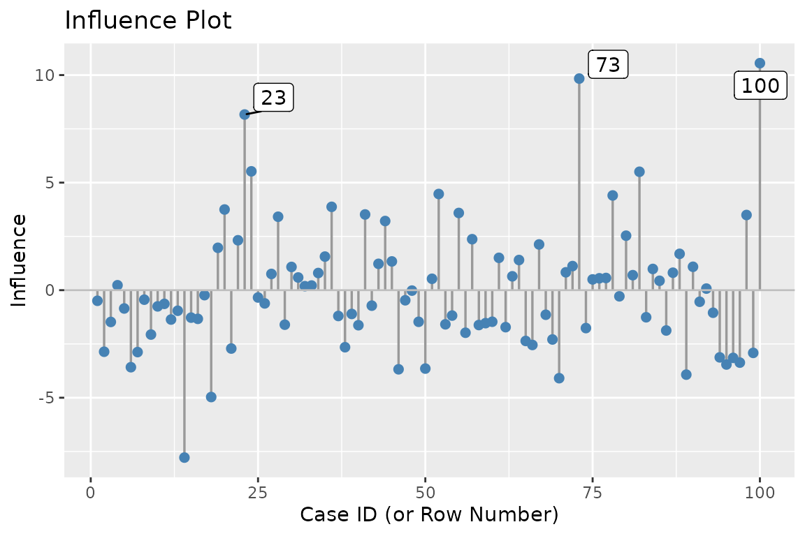
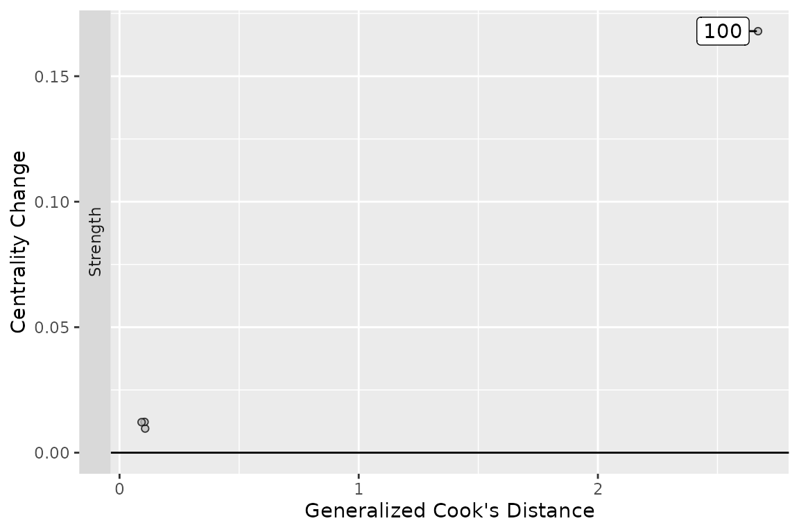
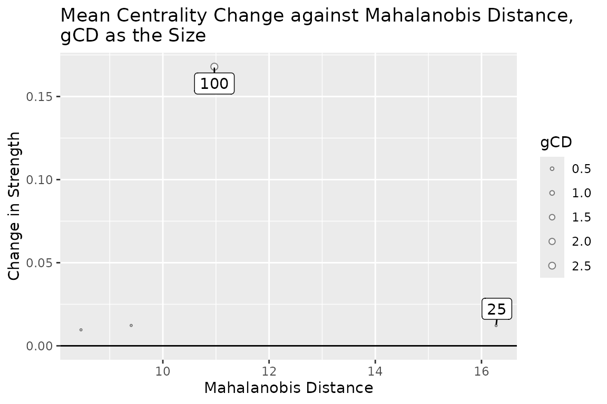

# netinf-quickstart

## Quick Start

`netinf` identifies **influential cases** in psychological network
analysis. It reuses the same bootstrap samples of `bootnet` for
influence diagnostics.

For the theory and formulas behind each step, see the [Detailed
Guide](https://yangborui859-maker.github.io/netinf/articles/netinf-detailedguide.md).

### Setup

``` r

library(netinf)
```

### The data

The package ships with a simulated dataset `test_data`: 100 cases × 9
variables. The last case (row 100) is an artificially constructed
influential case.

``` r

data("test_data", package = "netinf")
```

### The all-in-one function

For most users,
[`influence_diagnostic()`](https://yangborui859-maker.github.io/netinf/reference/influence_diagnostic.md)
runs the whole workflow in one call:

``` r

diag <- influence_diagnostic(
  data               = test_data,
  nBoots             = 5000,
  centrality_metrics = c("Strength", "Closeness", "Betweenness"), # Select the statistics to calculate the generalized Cook distance.
  default            = "EBICglasso",
  verbose            = FALSE
)
```

The output contains three parts:

- **Phase 1**: empirical influence values per case
- **Phase 2**: leave-one-out validation of top candidates
- **Phase 3**: centrality gCD (generalized Cook’s distance)

### Manual workflow

If you want to run each step yourself, the four functions form a
pipeline.

#### Step 1: bootstrap with case indices

[`bootnet_with_indices()`](https://yangborui859-maker.github.io/netinf/reference/bootnet_with_indices.md)
runs
[`bootnet::bootnet()`](https://rdrr.io/pkg/bootnet/man/bootnet.html) and
additionally stores the case index drawn in each bootstrap sample.

``` r

set.seed(1)
boot_res <- bootnet_with_indices(
  test_data,
  nBoots  = 5000,
  default = "EBICglasso"
)
#> Note: bootnet will store only the following statistics:  edge, strength, outStrength, inStrength
#> Estimating sample network...
#> Estimating Network. Using package::function:
#>   - qgraph::EBICglasso for EBIC model selection
#>     - using glasso::glasso
#> Bootstrapping...
#>   |                                                                              |                                                                      |   0%  |                                                                              |                                                                      |   1%  |                                                                              |=                                                                     |   1%  |                                                                              |=                                                                     |   2%  |                                                                              |==                                                                    |   2%  |                                                                              |==                                                                    |   3%  |                                                                              |==                                                                    |   4%  |                                                                              |===                                                                   |   4%  |                                                                              |===                                                                   |   5%  |                                                                              |====                                                                  |   5%  |                                                                              |====                                                                  |   6%  |                                                                              |=====                                                                 |   6%  |                                                                              |=====                                                                 |   7%  |                                                                              |=====                                                                 |   8%  |                                                                              |======                                                                |   8%  |                                                                              |======                                                                |   9%  |                                                                              |=======                                                               |   9%  |                                                                              |=======                                                               |  10%  |                                                                              |=======                                                               |  11%  |                                                                              |========                                                              |  11%  |                                                                              |========                                                              |  12%  |                                                                              |=========                                                             |  12%  |                                                                              |=========                                                             |  13%  |                                                                              |=========                                                             |  14%  |                                                                              |==========                                                            |  14%  |                                                                              |==========                                                            |  15%  |                                                                              |===========                                                           |  15%  |                                                                              |===========                                                           |  16%  |                                                                              |============                                                          |  16%  |                                                                              |============                                                          |  17%  |                                                                              |============                                                          |  18%  |                                                                              |=============                                                         |  18%  |                                                                              |=============                                                         |  19%  |                                                                              |==============                                                        |  19%  |                                                                              |==============                                                        |  20%  |                                                                              |==============                                                        |  21%  |                                                                              |===============                                                       |  21%  |                                                                              |===============                                                       |  22%  |                                                                              |================                                                      |  22%  |                                                                              |================                                                      |  23%  |                                                                              |================                                                      |  24%  |                                                                              |=================                                                     |  24%  |                                                                              |=================                                                     |  25%  |                                                                              |==================                                                    |  25%  |                                                                              |==================                                                    |  26%  |                                                                              |===================                                                   |  26%  |                                                                              |===================                                                   |  27%  |                                                                              |===================                                                   |  28%  |                                                                              |====================                                                  |  28%  |                                                                              |====================                                                  |  29%  |                                                                              |=====================                                                 |  29%  |                                                                              |=====================                                                 |  30%  |                                                                              |=====================                                                 |  31%  |                                                                              |======================                                                |  31%  |                                                                              |======================                                                |  32%  |                                                                              |=======================                                               |  32%  |                                                                              |=======================                                               |  33%  |                                                                              |=======================                                               |  34%  |                                                                              |========================                                              |  34%  |                                                                              |========================                                              |  35%  |                                                                              |=========================                                             |  35%  |                                                                              |=========================                                             |  36%  |                                                                              |==========================                                            |  36%  |                                                                              |==========================                                            |  37%  |                                                                              |==========================                                            |  38%  |                                                                              |===========================                                           |  38%  |                                                                              |===========================                                           |  39%  |                                                                              |============================                                          |  39%  |                                                                              |============================                                          |  40%  |                                                                              |============================                                          |  41%  |                                                                              |=============================                                         |  41%  |                                                                              |=============================                                         |  42%  |                                                                              |==============================                                        |  42%  |                                                                              |==============================                                        |  43%  |                                                                              |==============================                                        |  44%  |                                                                              |===============================                                       |  44%  |                                                                              |===============================                                       |  45%  |                                                                              |================================                                      |  45%  |                                                                              |================================                                      |  46%  |                                                                              |=================================                                     |  46%  |                                                                              |=================================                                     |  47%  |                                                                              |=================================                                     |  48%  |                                                                              |==================================                                    |  48%  |                                                                              |==================================                                    |  49%  |                                                                              |===================================                                   |  49%  |                                                                              |===================================                                   |  50%  |                                                                              |===================================                                   |  51%  |                                                                              |====================================                                  |  51%  |                                                                              |====================================                                  |  52%  |                                                                              |=====================================                                 |  52%  |                                                                              |=====================================                                 |  53%  |                                                                              |=====================================                                 |  54%  |                                                                              |======================================                                |  54%  |                                                                              |======================================                                |  55%  |                                                                              |=======================================                               |  55%  |                                                                              |=======================================                               |  56%  |                                                                              |========================================                              |  56%  |                                                                              |========================================                              |  57%  |                                                                              |========================================                              |  58%  |                                                                              |=========================================                             |  58%  |                                                                              |=========================================                             |  59%  |                                                                              |==========================================                            |  59%  |                                                                              |==========================================                            |  60%  |                                                                              |==========================================                            |  61%  |                                                                              |===========================================                           |  61%  |                                                                              |===========================================                           |  62%  |                                                                              |============================================                          |  62%  |                                                                              |============================================                          |  63%  |                                                                              |============================================                          |  64%  |                                                                              |=============================================                         |  64%  |                                                                              |=============================================                         |  65%  |                                                                              |==============================================                        |  65%  |                                                                              |==============================================                        |  66%  |                                                                              |===============================================                       |  66%  |                                                                              |===============================================                       |  67%  |                                                                              |===============================================                       |  68%  |                                                                              |================================================                      |  68%  |                                                                              |================================================                      |  69%  |                                                                              |=================================================                     |  69%  |                                                                              |=================================================                     |  70%  |                                                                              |=================================================                     |  71%  |                                                                              |==================================================                    |  71%  |                                                                              |==================================================                    |  72%  |                                                                              |===================================================                   |  72%  |                                                                              |===================================================                   |  73%
#> Note: Network with lowest lambda selected as best network: assumption of sparsity might be violated.
#>   |                                                                              |===================================================                   |  74%  |                                                                              |====================================================                  |  74%  |                                                                              |====================================================                  |  75%  |                                                                              |=====================================================                 |  75%  |                                                                              |=====================================================                 |  76%  |                                                                              |======================================================                |  76%  |                                                                              |======================================================                |  77%  |                                                                              |======================================================                |  78%  |                                                                              |=======================================================               |  78%  |                                                                              |=======================================================               |  79%  |                                                                              |========================================================              |  79%  |                                                                              |========================================================              |  80%  |                                                                              |========================================================              |  81%  |                                                                              |=========================================================             |  81%  |                                                                              |=========================================================             |  82%  |                                                                              |==========================================================            |  82%  |                                                                              |==========================================================            |  83%  |                                                                              |==========================================================            |  84%  |                                                                              |===========================================================           |  84%  |                                                                              |===========================================================           |  85%  |                                                                              |============================================================          |  85%  |                                                                              |============================================================          |  86%  |                                                                              |=============================================================         |  86%  |                                                                              |=============================================================         |  87%  |                                                                              |=============================================================         |  88%  |                                                                              |==============================================================        |  88%  |                                                                              |==============================================================        |  89%  |                                                                              |===============================================================       |  89%  |                                                                              |===============================================================       |  90%  |                                                                              |===============================================================       |  91%  |                                                                              |================================================================      |  91%  |                                                                              |================================================================      |  92%  |                                                                              |=================================================================     |  92%  |                                                                              |=================================================================     |  93%  |                                                                              |=================================================================     |  94%  |                                                                              |==================================================================    |  94%  |                                                                              |==================================================================    |  95%  |                                                                              |===================================================================   |  95%  |                                                                              |===================================================================   |  96%  |                                                                              |====================================================================  |  96%  |                                                                              |====================================================================  |  97%  |                                                                              |====================================================================  |  98%  |                                                                              |===================================================================== |  98%  |                                                                              |===================================================================== |  99%  |                                                                              |======================================================================|  99%  |                                                                              |======================================================================| 100%
#> Computing statistics...
#>   |                                                                              |                                                                      |   0%  |                                                                              |                                                                      |   1%  |                                                                              |=                                                                     |   1%  |                                                                              |=                                                                     |   2%  |                                                                              |==                                                                    |   2%  |                                                                              |==                                                                    |   3%  |                                                                              |==                                                                    |   4%  |                                                                              |===                                                                   |   4%  |                                                                              |===                                                                   |   5%  |                                                                              |====                                                                  |   5%  |                                                                              |====                                                                  |   6%  |                                                                              |=====                                                                 |   6%  |                                                                              |=====                                                                 |   7%  |                                                                              |=====                                                                 |   8%  |                                                                              |======                                                                |   8%  |                                                                              |======                                                                |   9%  |                                                                              |=======                                                               |   9%  |                                                                              |=======                                                               |  10%  |                                                                              |=======                                                               |  11%  |                                                                              |========                                                              |  11%  |                                                                              |========                                                              |  12%  |                                                                              |=========                                                             |  12%  |                                                                              |=========                                                             |  13%  |                                                                              |=========                                                             |  14%  |                                                                              |==========                                                            |  14%  |                                                                              |==========                                                            |  15%  |                                                                              |===========                                                           |  15%  |                                                                              |===========                                                           |  16%  |                                                                              |============                                                          |  16%  |                                                                              |============                                                          |  17%  |                                                                              |============                                                          |  18%  |                                                                              |=============                                                         |  18%  |                                                                              |=============                                                         |  19%  |                                                                              |==============                                                        |  19%  |                                                                              |==============                                                        |  20%  |                                                                              |==============                                                        |  21%  |                                                                              |===============                                                       |  21%  |                                                                              |===============                                                       |  22%  |                                                                              |================                                                      |  22%  |                                                                              |================                                                      |  23%  |                                                                              |================                                                      |  24%  |                                                                              |=================                                                     |  24%  |                                                                              |=================                                                     |  25%  |                                                                              |==================                                                    |  25%  |                                                                              |==================                                                    |  26%  |                                                                              |===================                                                   |  26%  |                                                                              |===================                                                   |  27%  |                                                                              |===================                                                   |  28%  |                                                                              |====================                                                  |  28%  |                                                                              |====================                                                  |  29%  |                                                                              |=====================                                                 |  29%  |                                                                              |=====================                                                 |  30%  |                                                                              |=====================                                                 |  31%  |                                                                              |======================                                                |  31%  |                                                                              |======================                                                |  32%  |                                                                              |=======================                                               |  32%  |                                                                              |=======================                                               |  33%  |                                                                              |=======================                                               |  34%  |                                                                              |========================                                              |  34%  |                                                                              |========================                                              |  35%  |                                                                              |=========================                                             |  35%  |                                                                              |=========================                                             |  36%  |                                                                              |==========================                                            |  36%  |                                                                              |==========================                                            |  37%  |                                                                              |==========================                                            |  38%  |                                                                              |===========================                                           |  38%  |                                                                              |===========================                                           |  39%  |                                                                              |============================                                          |  39%  |                                                                              |============================                                          |  40%  |                                                                              |============================                                          |  41%  |                                                                              |=============================                                         |  41%  |                                                                              |=============================                                         |  42%  |                                                                              |==============================                                        |  42%  |                                                                              |==============================                                        |  43%  |                                                                              |==============================                                        |  44%  |                                                                              |===============================                                       |  44%  |                                                                              |===============================                                       |  45%  |                                                                              |================================                                      |  45%  |                                                                              |================================                                      |  46%  |                                                                              |=================================                                     |  46%  |                                                                              |=================================                                     |  47%  |                                                                              |=================================                                     |  48%  |                                                                              |==================================                                    |  48%  |                                                                              |==================================                                    |  49%  |                                                                              |===================================                                   |  49%  |                                                                              |===================================                                   |  50%  |                                                                              |===================================                                   |  51%  |                                                                              |====================================                                  |  51%  |                                                                              |====================================                                  |  52%  |                                                                              |=====================================                                 |  52%  |                                                                              |=====================================                                 |  53%  |                                                                              |=====================================                                 |  54%  |                                                                              |======================================                                |  54%  |                                                                              |======================================                                |  55%  |                                                                              |=======================================                               |  55%  |                                                                              |=======================================                               |  56%  |                                                                              |========================================                              |  56%  |                                                                              |========================================                              |  57%  |                                                                              |========================================                              |  58%  |                                                                              |=========================================                             |  58%  |                                                                              |=========================================                             |  59%  |                                                                              |==========================================                            |  59%  |                                                                              |==========================================                            |  60%  |                                                                              |==========================================                            |  61%  |                                                                              |===========================================                           |  61%  |                                                                              |===========================================                           |  62%  |                                                                              |============================================                          |  62%  |                                                                              |============================================                          |  63%  |                                                                              |============================================                          |  64%  |                                                                              |=============================================                         |  64%  |                                                                              |=============================================                         |  65%  |                                                                              |==============================================                        |  65%  |                                                                              |==============================================                        |  66%  |                                                                              |===============================================                       |  66%  |                                                                              |===============================================                       |  67%  |                                                                              |===============================================                       |  68%  |                                                                              |================================================                      |  68%  |                                                                              |================================================                      |  69%  |                                                                              |=================================================                     |  69%  |                                                                              |=================================================                     |  70%  |                                                                              |=================================================                     |  71%  |                                                                              |==================================================                    |  71%  |                                                                              |==================================================                    |  72%  |                                                                              |===================================================                   |  72%  |                                                                              |===================================================                   |  73%  |                                                                              |===================================================                   |  74%  |                                                                              |====================================================                  |  74%  |                                                                              |====================================================                  |  75%  |                                                                              |=====================================================                 |  75%  |                                                                              |=====================================================                 |  76%  |                                                                              |======================================================                |  76%  |                                                                              |======================================================                |  77%  |                                                                              |======================================================                |  78%  |                                                                              |=======================================================               |  78%  |                                                                              |=======================================================               |  79%  |                                                                              |========================================================              |  79%  |                                                                              |========================================================              |  80%  |                                                                              |========================================================              |  81%  |                                                                              |=========================================================             |  81%  |                                                                              |=========================================================             |  82%  |                                                                              |==========================================================            |  82%  |                                                                              |==========================================================            |  83%  |                                                                              |==========================================================            |  84%  |                                                                              |===========================================================           |  84%  |                                                                              |===========================================================           |  85%  |                                                                              |============================================================          |  85%  |                                                                              |============================================================          |  86%  |                                                                              |=============================================================         |  86%  |                                                                              |=============================================================         |  87%  |                                                                              |=============================================================         |  88%  |                                                                              |==============================================================        |  88%  |                                                                              |==============================================================        |  89%  |                                                                              |===============================================================       |  89%  |                                                                              |===============================================================       |  90%  |                                                                              |===============================================================       |  91%  |                                                                              |================================================================      |  91%  |                                                                              |================================================================      |  92%  |                                                                              |=================================================================     |  92%  |                                                                              |=================================================================     |  93%  |                                                                              |=================================================================     |  94%  |                                                                              |==================================================================    |  94%  |                                                                              |==================================================================    |  95%  |                                                                              |===================================================================   |  95%  |                                                                              |===================================================================   |  96%  |                                                                              |====================================================================  |  96%  |                                                                              |====================================================================  |  97%  |                                                                              |====================================================================  |  98%  |                                                                              |===================================================================== |  98%  |                                                                              |===================================================================== |  99%  |                                                                              |======================================================================|  99%  |                                                                              |======================================================================| 100%
```

#### Step 2: empirical influence per case

[`calculate_empirical_influence()`](https://yangborui859-maker.github.io/netinf/reference/calculate_empirical_influence.md)
turns the bootstrap indices into a numeric influence value per case.

``` r

empic <- calculate_empirical_influence(boot_res)

print(empic, n = 10)   # 10 cases with largest absolute value
#> Empirical Influence Values
#> ==========================
#> 
#> Showing top 10 of 100 cases by absolute influence:
#> 
#>  case_id influence
#>      100 10.554229
#>       73  9.837622
#>       23  8.166919
#>       14 -7.783677
#>       24  5.524770
#>       82  5.505637
#>       18 -4.968687
#>       52  4.471433
#>       78  4.404015
#>       70 -4.092135
```

#### Step 3: leave-one-out validation

[`leave_one_out_analysis()`](https://yangborui859-maker.github.io/netinf/reference/leave_one_out_analysis.md)
removes the selected candidates and re-estimates the network to see what
changes.

There are three ways to select cases:

- `top_n`: top N by absolute influence from
  [`calculate_empirical_influence()`](https://yangborui859-maker.github.io/netinf/reference/calculate_empirical_influence.md)
- `threshold`: cases above a cutoff (with `direction` to pick the tail)
  from
  [`calculate_empirical_influence()`](https://yangborui859-maker.github.io/netinf/reference/calculate_empirical_influence.md)
- `remove_cases`: manually specified IDs

**Option 1 — top N:**

``` r

loo_res <- leave_one_out_analysis(
  influence_result = empic,
  data             = test_data,
  top_n            = 3,
  default          = "EBICglasso"
)
#> Selected 3 candidate case(s) for leave-one-out analysis
#> Case IDs: 100, 73, 23
#> Estimating full network...
#> Performing leave-one-out analysis...
#>   |                                                                              |                                                                      |   0%  |                                                                              |=======================                                               |  33%  |                                                                              |===============================================                       |  67%
#> Warning in EBICglassoCore(S = S, n = n, gamma = gamma, penalize.diagonal =
#> penalize.diagonal, : A dense regularized network was selected (lambda < 0.1 *
#> lambda.max). Recent work indicates a possible drop in specificity. Interpret
#> the presence of the smallest edges with care. Setting threshold = TRUE will
#> enforce higher specificity, at the cost of sensitivity.
#>   |                                                                              |======================================================================| 100%

loo_res
#> Leave-One-Out Analysis Results
#> ==============================
#> 
#> Selection method: top_3
#> Direction: both
#> Number of cases analyzed: 3
#> 
#> Summary:
#>   case_id empirical_influence global_weight-strength_change
#> 1     100           10.554229                  0.7557114974
#> 2      73            9.837622                  0.0973086900
#> 3      23            8.166919                  0.0009796011
#>   global_weight-strength_change(%) n_edges_disappeared n_edges_appeared
#> 1                      20.91975478                   6                0
#> 2                       2.69371836                   1                0
#> 3                       0.02711751                   0                0
#>   n_edges_reversed
#> 1                0
#> 2                0
#> 3                0
#> 
#> === Without Case 100: Structure Changes ===
#> 
#> Edges disappeared:
#>   x2 -- x6 : 0.038092121741292263 -> 0 
#>   x2 -- x7 : -0.070443780586514806 -> 0 
#>   x4 -- x7 : 0.025130867389584893 -> 0 
#>   x6 -- x7 : 0.027369962399648878 -> 0 
#>   x3 -- x8 : 0.040670512932712358 -> 0 
#>   x7 -- x9 : 0.032621213662403996 -> 0 
#> 
#> Edges appeared:
#>   None
#> 
#> Edge sign reversals:
#>   None
#> 
#> 
#> === Without Case 73: Structure Changes ===
#> 
#> Edges disappeared:
#>   x1 -- x8 : 0.014833658354640828 -> 0 
#> 
#> Edges appeared:
#>   None
#> 
#> Edge sign reversals:
#>   None
#> 
#> 
#> === Without Case 23: Structure Changes ===
#> 
#> Edges disappeared:
#>   None
#> 
#> Edges appeared:
#>   None
#> 
#> Edge sign reversals:
#>   None
```

**Option 2 — by threshold:**

``` r

loo_thr <- leave_one_out_analysis(
  influence_result = empic,
  data             = test_data,
  threshold        = 8,
  direction        = "both",        # "both" | "positive" | "negative"
  default          = "EBICglasso"
)
#> Selected 3 candidate case(s) for leave-one-out analysis
#> Case IDs: 23, 73, 100
#> Estimating full network...
#> Performing leave-one-out analysis...
#>   |                                                                              |                                                                      |   0%
#> Warning in EBICglassoCore(S = S, n = n, gamma = gamma, penalize.diagonal =
#> penalize.diagonal, : A dense regularized network was selected (lambda < 0.1 *
#> lambda.max). Recent work indicates a possible drop in specificity. Interpret
#> the presence of the smallest edges with care. Setting threshold = TRUE will
#> enforce higher specificity, at the cost of sensitivity.
#>   |                                                                              |=======================                                               |  33%  |                                                                              |===============================================                       |  67%  |                                                                              |======================================================================| 100%

loo_thr
#> Leave-One-Out Analysis Results
#> ==============================
#> 
#> Selection method: threshold_8
#> Direction: both
#> Number of cases analyzed: 3
#> 
#> Summary:
#>   case_id empirical_influence global_weight-strength_change
#> 1      23            8.166919                  0.0009796011
#> 2      73            9.837622                  0.0973086900
#> 3     100           10.554229                  0.7557114974
#>   global_weight-strength_change(%) n_edges_disappeared n_edges_appeared
#> 1                       0.02711751                   0                0
#> 2                       2.69371836                   1                0
#> 3                      20.91975478                   6                0
#>   n_edges_reversed
#> 1                0
#> 2                0
#> 3                0
#> 
#> === Without Case 23: Structure Changes ===
#> 
#> Edges disappeared:
#>   None
#> 
#> Edges appeared:
#>   None
#> 
#> Edge sign reversals:
#>   None
#> 
#> 
#> === Without Case 73: Structure Changes ===
#> 
#> Edges disappeared:
#>   x1 -- x8 : 0.014833658354640828 -> 0 
#> 
#> Edges appeared:
#>   None
#> 
#> Edge sign reversals:
#>   None
#> 
#> 
#> === Without Case 100: Structure Changes ===
#> 
#> Edges disappeared:
#>   x2 -- x6 : 0.038092121741292263 -> 0 
#>   x2 -- x7 : -0.070443780586514806 -> 0 
#>   x4 -- x7 : 0.025130867389584893 -> 0 
#>   x6 -- x7 : 0.027369962399648878 -> 0 
#>   x3 -- x8 : 0.040670512932712358 -> 0 
#>   x7 -- x9 : 0.032621213662403996 -> 0 
#> 
#> Edges appeared:
#>   None
#> 
#> Edge sign reversals:
#>   None
```

**Option 3 — manually remove specific cases (multiple →
leave-multiple-out):**

``` r

lmo_res <- leave_one_out_analysis(
  influence_result = empic,
  data             = test_data,
  remove_cases     = c(3, 7, 12),
  default          = "EBICglasso"
)
#> Performing leave-multiple-out analysis...
#> Warning in EBICglassoCore(S = S, n = n, gamma = gamma, penalize.diagonal =
#> penalize.diagonal, : A dense regularized network was selected (lambda < 0.1 *
#> lambda.max). Recent work indicates a possible drop in specificity. Interpret
#> the presence of the smallest edges with care. Setting threshold = TRUE will
#> enforce higher specificity, at the cost of sensitivity.

lmo_res
#> Leave-Multiple-Out Analysis Results
#> ===================================
#> 
#> Removed cases: 3, 7, 12
#> Number of removed cases: 3
#> 
#> Summary:
#>   case_ids global_weight-strength_change global_weight-strength_change(%)
#> 1 3, 7, 12                   -0.05325883                        -1.474322
#> 
#> === Without Cases 3, 7, 12: Structure Changes ===
#> 
#> Edges disappeared:
#>   None
#> 
#> Edges appeared:
#>   None
#> 
#> Edge sign reversals:
#>   None
```

#### Step 4: centrality gCD

[`calculate_centrality_gCD()`](https://yangborui859-maker.github.io/netinf/reference/calculate_centrality_gCD.md)
quantifies how much each case shifts the centrality vector.

``` r

gcd_res <- calculate_centrality_gCD(
  data        = test_data,
  boot_result = boot_res,
  case_ids    = c(100, 75, 50, 25),
  metric      = c("Strength", "Closeness", "Betweenness"),
  default     = "EBICglasso"
)
#> Estimating Network. Using package::function:
#>   - qgraph::EBICglasso for EBIC model selection
#>     - using glasso::glasso
#> Estimating Network. Using package::function:
#>   - qgraph::EBICglasso for EBIC model selection
#>     - using glasso::glasso
#> Warning in EBICglassoCore(S = S, n = n, gamma = gamma, penalize.diagonal =
#> penalize.diagonal, : A dense regularized network was selected (lambda < 0.1 *
#> lambda.max). Recent work indicates a possible drop in specificity. Interpret
#> the presence of the smallest edges with care. Setting threshold = TRUE will
#> enforce higher specificity, at the cost of sensitivity.
#> Estimating Network. Using package::function:
#>   - qgraph::EBICglasso for EBIC model selection
#>     - using glasso::glasso
#> Warning in EBICglassoCore(S = S, n = n, gamma = gamma, penalize.diagonal =
#> penalize.diagonal, : A dense regularized network was selected (lambda < 0.1 *
#> lambda.max). Recent work indicates a possible drop in specificity. Interpret
#> the presence of the smallest edges with care. Setting threshold = TRUE will
#> enforce higher specificity, at the cost of sensitivity.
#> Estimating Network. Using package::function:
#>   - qgraph::EBICglasso for EBIC model selection
#>     - using glasso::glasso
#> Warning in EBICglassoCore(S = S, n = n, gamma = gamma, penalize.diagonal =
#> penalize.diagonal, : A dense regularized network was selected (lambda < 0.1 *
#> lambda.max). Recent work indicates a possible drop in specificity. Interpret
#> the presence of the smallest edges with care. Setting threshold = TRUE will
#> enforce higher specificity, at the cost of sensitivity.

gcd_res
#>    case_id      metric        gCD
#> 1      100    Strength 2.66955723
#> 2       75    Strength 0.10710609
#> 3       50    Strength 0.10466219
#> 4       25    Strength 0.09214964
#> 5      100   Closeness 2.20986968
#> 6       75   Closeness 0.15354288
#> 7       50   Closeness 0.06266901
#> 8       25   Closeness 0.10603953
#> 9      100 Betweenness 3.02445721
#> 10      75 Betweenness 0.83791464
#> 11      50 Betweenness 0.83791464
#> 12      25 Betweenness 1.87117778
```

### Visualization

Three plot functions work with either the all-in-one object or
individual step outputs.

#### influence_plot

``` r

influence_plot(empic, largest_x = 3)
#> Note: no row names found; using 1:n as case IDs.
```



#### gcds_plot

``` r

gcds_plot(gcd_res, metrics = "Strength")
```



#### gcds_md_plot

``` r

gcds_md_plot(gcd_res, data = test_data, metric = "Strength")
```



### Tips

- If you already ran
  [`bootnet_with_indices()`](https://yangborui859-maker.github.io/netinf/reference/bootnet_with_indices.md),
  pass the result to
  [`influence_diagnostic()`](https://yangborui859-maker.github.io/netinf/reference/influence_diagnostic.md)
  to skip Step 1:
- Only `default = "EBICglasso"` is currently supported.
- [`calculate_centrality_gCD()`](https://yangborui859-maker.github.io/netinf/reference/calculate_centrality_gCD.md)
  needs `case_ids`; these can be any cases you want to diagnose—they do
  not have to come from
  [`leave_one_out_analysis()`](https://yangborui859-maker.github.io/netinf/reference/leave_one_out_analysis.md).

### Next steps

- [Detailed
  Guide](https://yangborui859-maker.github.io/netinf/articles/netinf-detailedguide.md)
  — theory, formulas, and interpretation for each step.
- [`?influence_diagnostic`](https://yangborui859-maker.github.io/netinf/reference/influence_diagnostic.md)
  — function reference.
